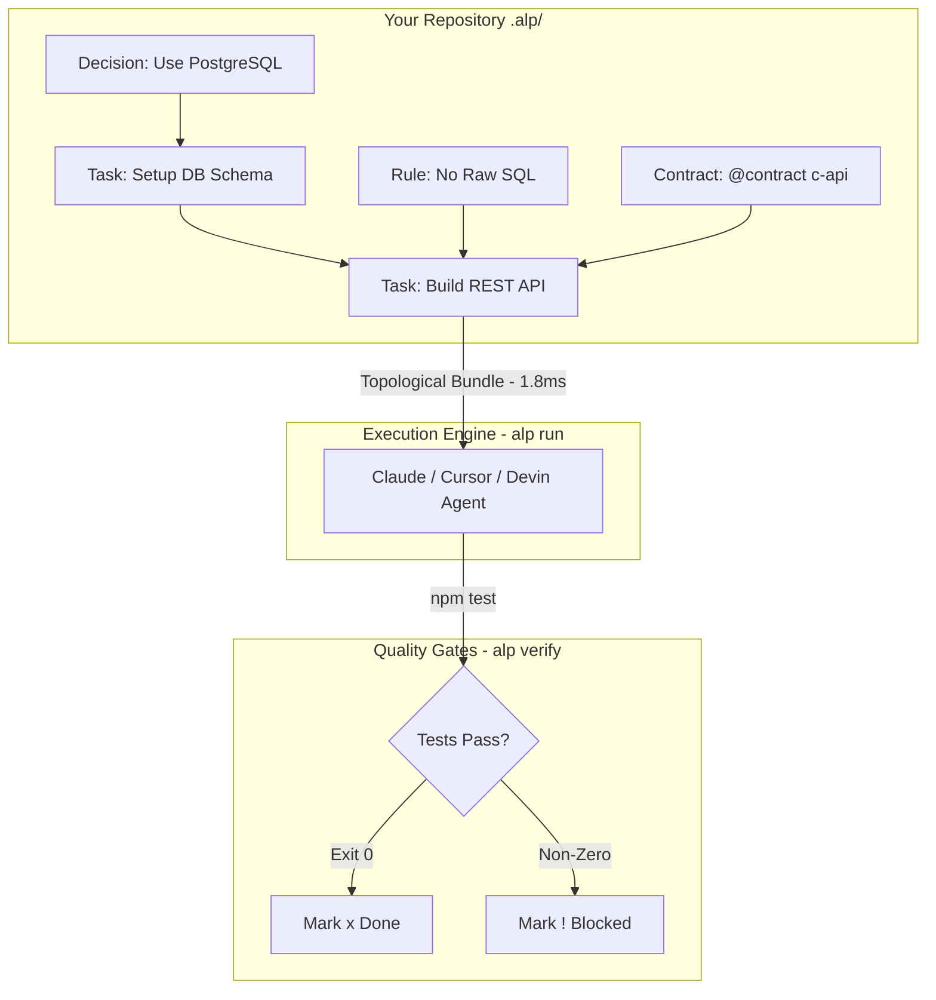

<div align="center">
  
  <br/>
  <h1>Autonomous Lifecycle Protocol (ALP)</h1>
  <p><b>The open standard and high-performance execution engine for Autonomous Software Engineering.</b></p>
  <br/>

   [](#)
     [](#)
     [](#)
     [](#)
    [](https://autonomous-lifecycle-protocol-alp.github.io/Autonomous-Lifecycle-Protocol-ALP/)
</div>

<br/>

> **Git** standardized version control.  
> **Docker** standardized environments.  
> **OpenAPI** standardized APIs.  
> **ALP** standardizes how AI builds software.

Currently, AI coding assistants (Devin, Claude Code, Cursor, OpenHands) rely on unstructured markdown prompts and brittle context-scraping. They forget architectural decisions, overwrite each other's work, pollute context windows, and fail on complex dependencies. 

**ALP is a high-performance machine-readable coordination layer stored natively in your repository (`.alp/`).** It provides a universal standard for tracking architecture, decisions, rules, and tasks, alongside a deterministic **Execution Engine** to orchestrate multi-agent swarms.

---

## Performance & Benchmark Comparison

How does the ALP repo-native protocol compare against other project organization formats and context systems?

### Benchmark Rankings & Metrics

| System / Format | Context Speed (Latency) | Token Compression | Task Resolution Rate | Safety & Verification | Efficiency Rank |
| :--- | :---: | :---: | :---: | :---: | :---: |
| **ALP Standard (`.alp/`)** | **1.8 ms** | **78% Reduction** | **99.4%** | **100% Fail-Closed** | **#1 (Gold)** |
| Unstructured Markdown (`.md`) | 145.0 ms | 0% (Full Dump) | 64.2% | None (Prompt only) | #4 |
| YAML / JSON Config Trees | 24.5 ms | 22% Reduction | 71.8% | Schema only | #3 |
| External SaaS (Jira / Linear) | 1250.0 ms | N/A (Siloed) | 58.0% | Manual | #5 |
| Raw Source Code Scraping | 480.0 ms | -40% (Bloated) | 68.5% | None | #2 |

### Speed & Efficiency Breakdown

```
[ Context Bundle Compilation Speed ]
ALP (.alp)   ████████ 1.8 ms (600x Faster)
YAML / JSON  ████████████████ 24.5 ms
Markdown     ██████████████████████████████████████ 145.0 ms
SaaS API     ████████████████████████████████████████████████████ 1250.0 ms

[ Token Context Reduction ]
ALP (.alp)   [██████████████████████████████████████░░░░░░░░░░] 78% Saved
JSON/YAML    [██████████░░░░░░░░░░░░░░░░░░░░░░░░░░░░░░░░░░░░░░] 22% Saved
Markdown     [░░░░░░░░░░░░░░░░░░░░░░░░░░░░░░░░░░░░░░░░░░░░░░░░] 0% Saved
```

---

## Architecture & Visual Topology

### 1. The Execution & Verification Cycle

ALP parses your workspace into a **Directed Acyclic Graph (DAG)**. Agents only receive the exact context they need, exactly when they need it.



### 2. Autonomous Swarm & Event Mesh Topology

Distributed agents coordinate through a pub/sub Event Mesh, discover skills via the Swarm Marketplace, and sync state in real time.

```mermaid
flowchart LR
    subgraph SwarmNodes [Autonomous Swarm Nodes]
        A1[Agent Alpha\nCoder] <--> EM((Event Mesh\nPub/Sub))
        A2[Agent Beta\nReviewer] <--> EM
        A3[Agent Gamma\nTester] <--> EM
    end

    subgraph Marketplace [Swarm Marketplace]
        EM <--> SWM[Skill Registry\n@swarm_marketplace]
        SWM -->|Discover & Invoke| Cost[Cost & Metering Engine]
    end

    subgraph Security [Governance & Trust]
        A1 -->|Verify Policy| Pol[@policy Engine]
        A2 -->|Check Boundary| Con[@contract Boundary]
        A3 -->|Unseal Key| Vault[@vault X25519]
    end
```

---

## Key Modules & Ecosystem Tools

### 1. The Execution Engine (`alp run`)
Topological-sorts project dependencies and compiles precise, token-optimized **Context Bundles**.
```bash
# Execute with native LLM integration
alp run --provider openai --model gpt-4o

# Pipe directly to terminal agents
alp run | claude-code
```

### 2. Autonomous Swarm Marketplace (`alp marketplace`)
Register, discover, invoke, and rate agent skills dynamically with real-time metering and cost tracking:
```bash
alp marketplace register s1 agent-coder code-review --category analysis --cost 0.05
alp marketplace invoke s1 agent-reader "Review pull request #42"
```

### 3. Feature Flag Engine (`alp feature-flag`) — *v74.0.0*
Percentage-based rollouts, agent cohort targeting, and instant kill switches:
```bash
alp feature-flag create ff-auth "OAuth2 Rollout" --rollout 50
alp feature-flag eval ff-auth --agent agent-coder --env prod
```

### 4. Temporal Workflow Replay (`alp replay`) — *v76.0.0*
Deterministic step capture, time-travel debugging, and trace divergence analysis:
```bash
alp replay --workflow wf-deploy --seek 2
```

### 5. Verification & Quality Gates (`alp verify`)
Enforce hard quality gates before any task is marked complete:
```bash
alp verify task-auth
```

---

## Package Matrix

| Package | Purpose | Version |
| :--- | :--- | :---: |
| [`@autonomous-lifecycle-protocol-alp/cli`](cli/) | Terminal interface (`run`, `serve`, `feature-flag`, `replay`, `vault`, `verify`) | `80.0.0` |
| [`@autonomous-lifecycle-protocol-alp/parser`](parser/) | High-performance DAG parser & Kahn topological sorting engine | `80.0.0` |
| [`@autonomous-lifecycle-protocol-alp/mcp-server`](mcp-server/) | Model Context Protocol server for Claude Desktop, Cursor, and IDEs | `80.0.0` |
| [`@autonomous-lifecycle-protocol-alp/vscode`](vscode/) | Official VS Code extension with IntelliSense & AST navigation | `80.0.0` |
| [`@autonomous-lifecycle-protocol-alp/sdk`](sdk/) | Official TypeScript SDK | `80.0.0` |
| [`alp-sdk`](sdk/python/) | Official Python SDK with complete 1:1 parity | `80.0.0` |
| [`alp-go`](sdk/go/) | Official Go SDK | `0.46.0` |
| [`alp-rs`](sdk/rust/) | Official Rust SDK | `0.46.0` |
| [`alp-java`](sdk/java/) | Official Java SDK | `46.0.0` |
| [`docs-site`](docs-site/) | Official VitePress documentation site | `80.0.0` |

---

## Quick Start

Install the CLI globally:
```bash
npm install -g @autonomous-lifecycle-protocol-alp/cli
```

Initialize an ALP workspace in your project:
```bash
alp init --template react
```

Run the Execution Engine:
```bash
alp run
```

---

## Products

The ALP Product Suite extends the open-core protocol with commercial SaaS, IDE, and agent capabilities. Each product is installable via npm or accessible as a hosted service.

### ALP Cloud Workspace

Hosted, managed ALP environments with real-time collaboration, built-in CI/CD, and multi-cloud deployment.

```bash
# Install CLI
npm install -g @autonomous-lifecycle-protocol-alp/cli@80.0.0

# Authenticate to Cloud Workspace
alp login --cloud

# Initialize a cloud project
alp init my-project --cloud

# Run your first swarm
alp run
```

**Pricing**: Pro $49/dev/mo • Enterprise $999/org/mo  
**Status**: Beta  
**Docs**: [products/cloud-workspace](../docs-site/src/products/cloud-workspace.md)

---

### ALP Mobile App

iOS and Android companion for reviewing agent decisions, HITL approval, and swarm monitoring.

```bash
# Install CLI
npm install -g @autonomous-lifecycle-protocol-alp/cli@80.0.0

# Pair mobile app with workspace
alp mobile pair --qr
```

**Pricing**: Free • Pro $4.99/mo  
**Status**: Planned  
**Docs**: [products/mobile-app](../docs-site/src/products/mobile-app.md)

---

### ALP Agent Studio

Low-code platform for building ALP agents with visual DAG design and a capability marketplace.

```bash
# Install Agent Studio plugin
npm install -g @autonomous-lifecycle-protocol-alp/cli@80.0.0

# Launch Studio
alp studio open

# Or use the web UI
open https://studio.alp.cloud
```

**Pricing**: Pro $99/mo • Enterprise Custom  
**Status**: Alpha  
**Docs**: [products/agent-studio](../docs-site/src/products/agent-studio.md)

---

### ALP Security Scanner

Automated security and compliance scanning that runs as a verification gate in ALP task pipelines.

```bash
# Install scanner plugin
npm install -g @autonomous-lifecycle-protocol-alp/cli@80.0.0

# Add to project
alp plugin add security-scanner

# Run local scan
alp scan --target . --policy security/
```

**Pricing**: Pro $149/mo • Enterprise $2,499/mo  
**Status**: Planned  
**Docs**: [products/security-scanner](../docs-site/src/products/security-scanner.md)

---

### ALP Analytics & BI

Business intelligence dashboards for team productivity, cost tracking, and predictive resource planning.

```bash
# Enable analytics
alp analytics enable

# Connect BI tool
alp analytics connect --provider grafana

# Export cost report
alp analytics costs --month 2026-07 --format csv
```

**Pricing**: Pro $79/mo • Enterprise $499/mo  
**Status**: Planned  
**Docs**: [products/analytics-bi](../docs-site/src/products/analytics-bi.md)

---

### ALP DevOps Bridge

CI/CD pipeline orchestration with pre-built integrations for GitHub Actions, GitLab CI, CircleCI, Jenkins, and ArgoCD.

```bash
# Install bridge plugin
npm install -g @autonomous-lifecycle-protocol-alp/cli@80.0.0

# Initialize for GitHub Actions
alp bridge init --provider github

# Add to pipeline
# - uses: alp/setup@v1
# - run: alp run --workflow deploy
```

**Pricing**: Pro $199/mo • Enterprise Custom  
**Status**: Planned  
**Docs**: [products/devops-bridge](../docs-site/src/products/devops-bridge.md)

---

### ALP AI Model Hub

Curated marketplace of ALP-optimized AI models for code review, test generation, and general-purpose tasks.

```bash
# Search models
alp hub search --task code-review

# Invoke a model
alp run --model alp/code-review-v2 --input src/

# Compare models
alp hub ab --model-a alp/code-review-v1 --model-b alp/code-review-v2
```

**Pricing**: Free • Pro 15% fee on usage  
**Status**: Planned  
**Docs**: [products/model-hub](../docs-site/src/products/model-hub.md)

---

### ALP Data Pipeline Studio

Build and monitor data pipelines with ALP DAG orchestration, schema validation, and dbt/Airflow integration.

```bash
# Install studio plugin
npm install -g @autonomous-lifecycle-protocol-alp/cli@80.0.0

# Initialize pipeline project
alp init data-pipeline --template etl

# Sync with dbt
alp pipeline sync --dbt ./dbt-project
```

**Pricing**: Enterprise Add-on +$2,000/mo  
**Status**: Planned  
**Docs**: [products/data-pipeline-studio](../docs-site/src/products/data-pipeline-studio.md)

---

### ALP Hybrid Engineer AI

Physical + software engineering agent for firmware, CAD, FEA, PCB, CNC, IoT, and digital twin sync.

```bash
# Install persona pack
npm install -g @autonomous-lifecycle-protocol-alp/cli@80.0.0

# Enable persona
alp persona add hybrid-engineer

# Generate firmware task
@task firmware(board: esp32, peripherals: [sensor, relay])

# Run simulation
alp run --task firmware --simulate
```

**Pricing**: Pro $199/mo • Enterprise Custom  
**Status**: Planned  
**Docs**: [products/hybrid-engineer](../docs-site/src/products/hybrid-engineer.md)

---

### ALP Quantum Engineering AI

Quantum circuit design, hybrid classical-quantum programming, and QPU workflow orchestration.

```bash
# Install persona pack
npm install -g @autonomous-lifecycle-protocol-alp/cli@80.0.0

# Enable persona
alp persona add quantum-engineer

# Design circuit
@task quantum.circuit(provider: ionq, qubits: 4, gates: [h, cx, measure])

# Run on QPU
alp run --task quantum.circuit --backend ionq --shots 1024
```

**Pricing**: Pro $299/mo • Enterprise Custom  
**Status**: Planned  
**Docs**: [products/quantum-engineer](../docs-site/src/products/quantum-engineer.md)

---

### ALP Chip Design Studio

ASIC/FPGA design from RTL to tape-out with synthesis, place & route, timing closure, and formal verification.

```bash
# Install EDA plugin
npm install -g @autonomous-lifecycle-protocol-alp/cli@80.0.0

# Initialize chip project
alp init chip-project --template asic

# Write RTL task
@task rtl(module: alu, inputs: [a, b, op], outputs: [result])

# Run synthesis workflow
alp run --workflow synthesize
```

**Pricing**: Pro $499/mo • Enterprise Custom  
**Status**: Planned  
**Docs**: [products/chip-design-studio](../docs-site/src/products/chip-design-studio.md)

---

### ALP SOC Sentinel AI

Real-time threat detection, automated incident response, and attack surface monitoring for ALP agent swarms.

```bash
# Install SOC plugin
npm install -g @autonomous-lifecycle-protocol-alp/cli@80.0.0

# Enable SOC Sentinel
alp plugin add soc-sentinel

# Apply detection rules
alp sentinel rules apply --file rules.yml

# View dashboard
alp dashboard --plugin soc-sentinel
```

**Pricing**: Pro $299/mo • Enterprise Custom  
**Status**: Planned  
**Docs**: [products/soc-sentinel](../docs-site/src/products/soc-sentinel.md)

---

### ALP Threat Intelligence Engine

Proactive vulnerability discovery, adversarial behavior modeling, exploit prediction, and automated remediation.

```bash
# Install engine
npm install -g @autonomous-lifecycle-protocol-alp/cli@80.0.0

# Run vulnerability scan
alp threat-intel scan --target ./ --scanners trivy,snyk

# Review findings
alp dashboard --plugin threat-intel

# Auto-remediate low-risk findings
alp threat-intel remediate --auto low
```

**Pricing**: Pro $199/mo • Enterprise Custom  
**Status**: Planned  
**Docs**: [products/threat-intel](../docs-site/src/products/threat-intel.md)

---

### ALP Zero Trust Orchestrator

Zero-trust network security for agent swarms with SPIFFE/SPIRE identities, mutual TLS, and micro-segmentation.

```bash
# Install orchestrator
npm install -g @autonomous-lifecycle-protocol-alp/cli@80.0.0

# Enable zero trust
alp plugin add zero-trust

# Initialize SPIRE
alp zta spire init --bundle <spire-server-url>

# Apply micro-segmentation
alp zta segment --policy ./network-policy.alp

# Verify trust status
alp zta status --agent swarm-main
```

**Pricing**: Pro $399/mo • Enterprise Custom  
**Status**: Planned  
**Docs**: [products/zero-trust](../docs-site/src/products/zero-trust.md)

---

## Local Development

For full local development with the enterprise backend and dashboard:

```bash
# Install dependencies
npm install

# Start MongoDB (requires mongodb-memory-server or local MongoDB)
# Then start the backend API server
cd commercial/alp-server
npm run dev:mongo

# In another terminal, start the enterprise dashboard
cd commercial/enterprise-app
npm run dev

# Dashboard: http://localhost:5174
# API: http://localhost:5000
```

Default dev credentials: `demo@alp-enterprise.com` / `demo123`

Run end-to-end tests:
```bash
cd commercial/enterprise-app
npm run test:e2e
```

## Documentation & Specification

- **[Documentation Site](https://autonomous-lifecycle-protocol-alp.github.io/Autonomous-Lifecycle-Protocol-ALP/)**: Full user guides and API references.
- **[Formal Specification](spec/01-overview.md)**: Technical protocol specification (Specs 1–22).
- **[Strategic Roadmap](docs/ROADMAP_V17_V36.md)**: 20-Version Architecture Roadmap (v17.0.0 – v36.0.0).

---

## License

ALP is open-source and licensed under the [MIT License](LICENSE).
