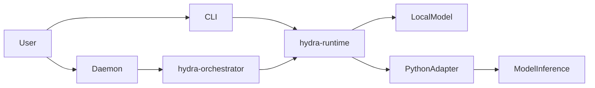

# Architecture

HYDRA Portable is built as a Rust workspace with a Python AI/ML boundary.

## Runtime

The primary runtime is a Rust workspace at the project root. Key crates:

| Crate | Purpose |
|-------|---------|
| `hydra-core` | Core types, interfaces, and configuration |
| `hydra-runtime` | Model runtime, routing, and selection |
| `hydra-orchestrator` | Creative pipeline and task orchestration |
| `hydra-scheduler` | Task scheduling and dispatch |
| `hydra-daemon` | HTTP daemon with `/creative` endpoint |
| `hydra-cli` | Command-line interface |

## AI/ML Boundary

Python package under `python/hydra/` provides:

- `LocalModelAdapter` — Local model inference wrapper
- `GenerationRequest` / `GenerationResult` — Structured generation types
- `Modality` — Text, Image, Video, Model3D, Audio, Code

## Protocol

- **gRPC + protobuf** — `protobuf/hydra.proto`
- **HTTP REST** — `hydra-daemon` exposes `/task`, `/creative`, `/status`, `/stop`, `/emergency-stop`

## UI

- **Tauri desktop** — `apps/hydra-ui/src-tauri/`
- **React web UI** — `apps/hydra-ui/`

## Data Flow



## Directory Structure

```
alp-portable/HYDRA/
├── Cargo.toml              # Rust workspace root
├── crates/                 # Rust workspace crates
│   ├── hydra-core/         # Core types and interfaces
│   ├── hydra-runtime/      # Model runtime, routing, selection
│   ├── hydra-orchestrator/ # Creative pipeline, task orchestration
│   ├── hydra-scheduler/    # Task scheduling and dispatch
│   └── hydra-daemon/       # HTTP daemon
├── python/                 # AI/ML Python package
│   └── hydra/
│       ├── inference.py    # Local model adapter
│       ├── skills.py       # Skill registry SDK
│       └── tools.py        # Tool implementations
├── protobuf/               # gRPC protocol definitions
├── apps/
│   ├── hydra-cli/          # CLI client
│   ├── hydra-daemon/       # Background daemon
│   └── hydra-ui/           # Tauri + React UI
└── docs/                   # Documentation
```
