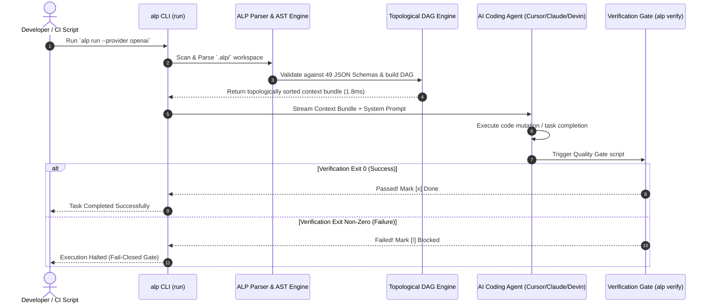
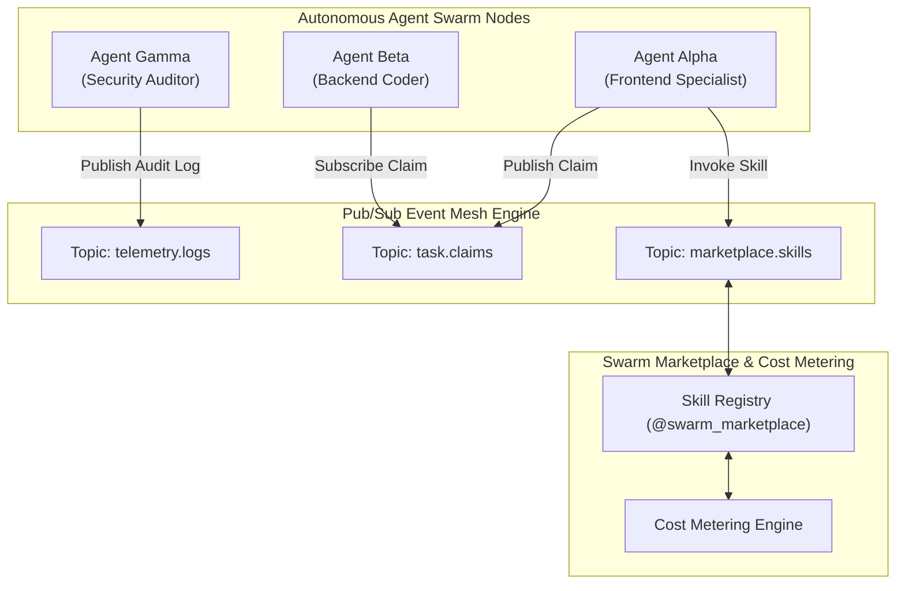
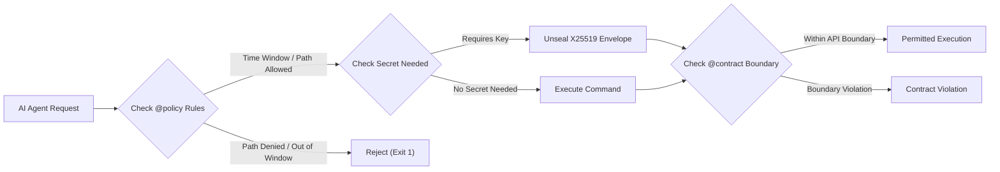
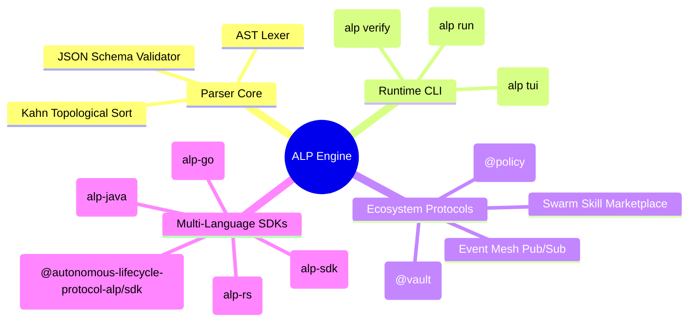

# System Architecture & Visual Topology

This section provides a deep technical breakdown of the Autonomous Lifecycle Protocol (ALP) runtime architecture, topological dependency engine, distributed event mesh, and security governance layers.

---

## 1. The Topological Execution Loop

ALP parses repository definitions (`.alp/`) into a Directed Acyclic Graph (DAG) using Kahn's algorithm for topological sorting. Agents receive precise context bundles compiled in real-time (< 2ms).

---

## 2. Autonomous Swarm & Pub/Sub Event Mesh Topology

Distributed agent nodes coordinate asynchronously over a decoupled Pub/Sub Event Mesh. Topics handle telemetry, task claim broadcasts, and real-time skill marketplace invocations.

---

## 3. Governance, Vault, & Policy Boundary Layer

Security and governance policies are checked deterministically before any file system write or system action is permitted.

---

## System Module Map

