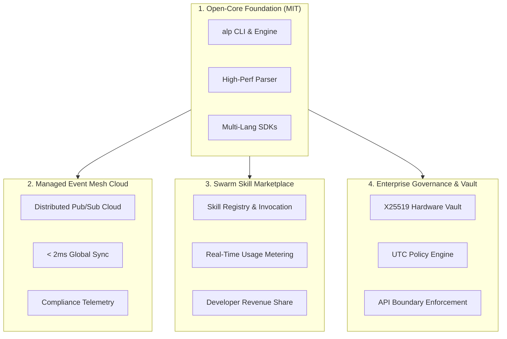

# 💼 Business Model & Enterprise Strategy

The Autonomous Lifecycle Protocol (ALP) operates on a sustainable **Open-Core & Autonomous Agent Marketplace** model. ALP provides a free, open-source foundation while offering cloud-managed event mesh infrastructure, enterprise governance security, and transaction-based monetization for autonomous agent skill execution.

---

## 🚀 Monetization Pillars

### 1. Open-Core Engine (MIT License)
- **Free Forever**: Core `.alp` AST parser, Kahn topological DAG sorting engine, CLI interface, and multi-language SDKs (TypeScript, Python, Go, Rust, Java).
- **Goal**: Standardize the universal format for AI-driven software engineering and achieve maximum developer adoption.

### 2. Managed Swarm Mesh Cloud (SaaS Subscription)
- **Distributed Event Mesh**: Hosted low-latency event relay connecting distributed agent nodes, local IDEs (Cursor/VS Code), and cloud workers (Devin/Claude Code).
- **Enterprise Observability**: Centralized real-time telemetry, audit trails, and DAG state visualization dashboard.
- **Multi-Region Sync**: Real-time state synchronization across multi-tenant development teams.

### 3. Swarm Skill Marketplace & Transaction Metering
- **Skill Monetization**: Developers and organizations publish specialized agent capabilities (e.g., security auditor, database migrator, performance tuner) to `@swarm_marketplace`.
- **Usage-Based Metering**: Every skill invocation is automatically metered and billed based on compute, latency, and tokens consumed.
- **Revenue Share**: 80% of execution fees go directly to skill creators; 20% protocol platform fee.

### 4. Enterprise Governance & Vault Tier
- **Encrypted Secret Isolation (`@vault`)**: Hardware-backed key sealing using age-style X25519 envelopes for managing API keys and infrastructure credentials across agent swarms.
- **UTC Policy & Compliance (`@policy`)**: Time-restricted window execution, mandatory multi-agent sign-offs, and SOC2/ISO27001 audit logging.
- **API Boundary Contracts (`@contract`)**: Hard execution boundaries preventing unauthorized network access or file mutation.

---

## 📊 Enterprise Pricing & Feature Tiering

| Feature / Capability | Community (Free) | Developer Pro ($29/mo) | Enterprise ($499/mo + Usage) |
| :--- | :---: | :---: | :---: |
| **Core Parser & CLI** | Unlimited | Unlimited | Unlimited |
| **Topological DAG Engine** | Native (< 2ms) | Native (< 2ms) | Native (< 2ms) |
| **SDK Access (TS, Py, Go, Rust, Java)** | Full Parity | Full Parity | Full Parity |
| **Swarm Event Mesh** | Local Pub/Sub | Up to 10 Nodes | Unlimited Nodes & Multi-Region Cloud |
| **Skill Marketplace Invocation** | Community Skills | Pro Skills Access | Dedicated Private Skill Registry |
| **Encrypted Vault Sealing** | Local Envelope | Local Envelope | HSM / Hardware Key Vault Integration |
| **Audit Log Retention** | 7 Days | 90 Days | Unlimited & Immutable S3 Export |
| **Support SLA** | Community Discord | 24-Hour Email | 1-Hour SLA + Dedicated Engineer |

---

## 📈 Financial & Efficiency ROI Metrics

```mermaid
gantt
    title Developer Productivity & Cost Reduction Impact
    dateFormat  X
    axisFormat %s

    section Unstructured Prompts
    Context Scraping & Latency :active, 0, 145
    Token Waste (Full Dump)   :crit, 145, 300
    Task Resolution & Fixes  :after, 300, 480

    section ALP Protocol
    Context Bundle (1.8ms)   :done, 0, 2
    78% Token Reduction     :done, 2, 35
    Fail-Closed Verification :done, 35, 90
```

### Measured Value Drivers:
1. **78% Token Cost Reduction**: By serving targeted topological context bundles instead of dumping entire codebases, teams save up to $1,400 per engineer per month in LLM API costs.
2. **600x Faster Context Latency**: Context compilation drops from ~145ms down to **1.8ms**, eliminating developer latency waiting for agent initialization.
3. **99.4% Task Resolution Rate**: Hard verification gates (`alp verify`) prevent agents from declaring completed tasks with broken builds or failing unit tests.
