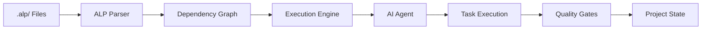
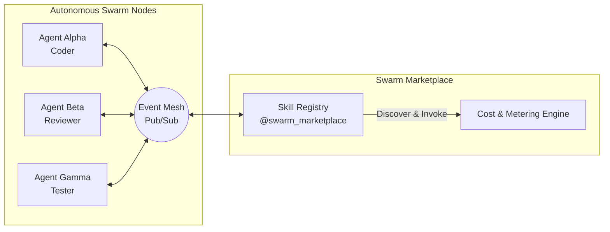

## Why ALP?

> **Git** standardized version control. **Docker** standardized environments. **OpenAPI** standardized APIs.
> **ALP** standardizes how AI builds software.

Today every AI coding assistant (Devin, Claude Code, Cursor, OpenHands) relies on unstructured
prompts and brittle context-scraping. They forget decisions, overwrite each other's work, and lose
track of dependencies. ALP replaces scattered `README.md`, `PRD.md`, `AGENTS.md`, and `TASKS.md`
files with **one deterministic protocol stored natively in your repository** (`.alp/`).

<div class="alp-stats">
  <div class="alp-stat"><span class="alp-stat-num">49</span><span class="alp-stat-label">JSON Schemas</span></div>
  <div class="alp-stat"><span class="alp-stat-num">80.0.0</span><span class="alp-stat-label">Toolchain Release</span></div>
  <div class="alp-stat"><span class="alp-stat-num">1013+</span><span class="alp-stat-label">Passed Tests</span></div>
  <div class="alp-stat"><span class="alp-stat-num">1:5</span><span class="alp-stat-label">Language SDK Parity</span></div>
</div>

---

## How it works

ALP turns your repository into a **deterministic, machine-readable project specification** that any AI agent can read, understand, and act on.



1. **Write** — Define your project in `.alp/` files using the ALP protocol
2. **Parse** — The parser builds a dependency graph and validates against 49 JSON schemas
3. **Execute** — The engine topologically sorts tasks and compiles context bundles in < 2ms
4. **Verify** — Quality gates ensure tasks aren't marked done until tests pass
5. **Remember** — Cross-session memory eliminates redundant context scraping

---

## Quick Example

Create a `.alp` file in your repository:

```alp
!alp-version: 80.0.0

@project
  id: my-project
  name: My Project
  version: 1.0.0
  state: active

@feature
  id: feat-auth
  name: Authentication
  description: OAuth2 + JWT authentication flow

@task
  id: task-login-ui
  name: Build login UI
  status: [ ]
  depends_on:
    - task-setup-db
  verify:
    - npm run test:login
    - npm run lint:login

@agent
  id: agent-frontend
  name: Frontend Specialist
  capabilities: [react, typescript, tailwind]
```

Then run:

```bash
# Validate your workspace
alp validate

# Execute the next available task
alp run

# Verify quality gates
alp verify task-login-ui
    end
    
    subgraph ExecutionEngine [Execution Engine - alp run]
        T2 -->|Context Bundle - 1.8ms| Agent[Claude / Cursor Agent]
    end

    subgraph QualityGates [Quality Gates - alp verify]
        Agent -->|npm test| V{Tests Pass?}
        V -->|Exit 0| X[Mark x Done]
        V -->|Non-Zero| B[Mark ! Blocked]
    end
```

### 2. Autonomous Swarm Mesh & Skill Marketplace (v80.0.0)



---

## 📦 The ALP Ecosystem

<div class="alp-eco">
  <a class="alp-eco-card" href="/guide/cli"><h3>@autonomous-lifecycle-protocol-alp/cli</h3><p>Terminal CLI interface: <code>run</code>, <code>marketplace</code>, <code>event-mesh</code>, <code>policy</code>, <code>vault</code>, <code>verify</code>.</p></a>
  <a class="alp-eco-card" href="/spec/03-protocol-objects"><h3>@autonomous-lifecycle-protocol-alp/parser</h3><p>Parses <code>.alp</code> files and computes Kahn topological sorts over the dependency graph in sub-2ms.</p></a>
  <a class="alp-eco-card" href="/mcp-server"><h3>@autonomous-lifecycle-protocol-alp/mcp-server</h3><p>Real-time MCP integration for Claude Desktop, Cursor, and any compliant client.</p></a>
  <a class="alp-eco-card" href="/vscode-extension"><h3>alp-vscode</h3><p>Language Server with IntelliSense, go-to-definition, and rich hover metadata.</p></a>
  <a class="alp-eco-card" href="/guide/sdk"><h3>@autonomous-lifecycle-protocol-alp/sdk &amp; alp-sdk</h3><p>Official TypeScript and Python SDKs with complete 1:1 implementation parity.</p></a>
  <a class="alp-eco-card" href="/guide/sdk"><h3>alp-go / alp-rs / alp-java</h3><p>Official Go, Rust, and Java SDKs with core parsing, graph, and workspace APIs.</p></a>
  <a class="alp-eco-card" href="/spec/22-autonomous-marketplace"><h3>@swarm_marketplace</h3><p>Autonomous skill registry, provider discovery, invocation, and cost tracking (v38.0.0).</p></a>
  <a class="alp-eco-card" href="/sham"><h3>SHAM IDE</h3><p>The unified ALP desktop IDE (Mac/Windows/Linux). Faster, more secure, and error-free vs. fragmented multi-IDE setups. Native <code>@autonomous-lifecycle-protocol-alp/parser</code>, Monaco editor, agent manager, and integrated terminal.</p></a>
</div>

---

## 🚀 Getting Started in 60 Seconds

### Step 1: Install the CLI

```bash
npm install -g @autonomous-lifecycle-protocol-alp/cli
```

### Step 2: Initialize your workspace

```bash
alp init
```

This creates a `.alp/` directory with a starter `project.alp` file.

### Step 3: Define your first feature

Create `.alp/features.alp`:

```alp
!alp-version: 80.0.0

@feature
  id: feat-auth
  name: User Authentication
  description: OAuth2 + JWT authentication flow

@task
  id: task-login-ui
  name: Build login UI
  status: [ ]
  depends_on:
    - task-setup-db
  verify:
    - npm run test:login
    - npm run lint:login
```

### Step 4: Validate and execute

```bash
# Validate your workspace
alp validate

# Execute the next available task
alp run

# Verify quality gates
alp verify task-login-ui
```

---

## 📚 Learn More

<div class="alp-eco">
  <a class="alp-eco-card" href="/guide/cli"><h3>📖 CLI Guide</h3><p>Complete guide to the ALP CLI — initialization, validation, execution, and all commands.</p></a>
  <a class="alp-eco-card" href="/spec/01-overview"><h3>📐 Specification</h3><p>Deep dive into the ALP protocol — syntax, objects, engines, memory model, and more.</p></a>
  <a class="alp-eco-card" href="/mcp-server"><h3>🔌 MCP Server</h3><p>Connect ALP to Claude Desktop, Cursor, and other MCP-compatible tools.</p></a>
  <a class="alp-eco-card" href="/vscode-extension"><h3>💻 VS Code Extension</h3><p>IntelliSense, go-to-definition, and DAG visualization in VS Code.</p></a>
  <a class="alp-eco-card" href="/guide/sdk"><h3>🛠️ SDKs</h3><p>TypeScript, Python, Go, Rust, and Java SDKs with full API reference.</p></a>
  <a class="alp-eco-card" href="/cli-tools"><h3>🛠️ CLI Tools Reference</h3><p>Complete reference for all CLI commands, flags, and workflows.</p></a>
</div>

---

## 🗺️ Future Plans & Roadmap

Released versions are tracked in the [versioning spec](/spec/10-versioning.md). This section captures active and planned focus areas.

| Era | Versions | Focus |
|---|---|---|
| V8 — The Collaboration Era | 38.0.0–38.x | Event mesh, swarm marketplace, macro expansion, collaboration/negotiation/reputation, memory mesh |
| V9 — Native Desktop | 80.0.0 | SHAM IDE cross-platform release, native ALP integration, Monaco editor, agent manager, auto-updater, Pro/Enterprise licensing |
| V10 — The Intelligence Era | 80.0.0+ | Autonomous orchestration, self-healing workflows, predictive governance, edge-native execution |

### What's Next

- **SHAM IDE** (V9, 80.0.0) — Already released. Cross-platform desktop application for Mac, Windows, and Linux with native ALP integration, Monaco editor, agent manager, auto-updater, and Pro/Enterprise licensing.
- **V10 — The Intelligence Era** (80.0.0+) — Autonomous multi-agent orchestration with self-healing DAGs, predictive governance, edge-native execution, and AI-native lifecycle management.


