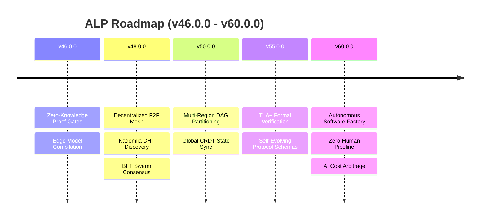

# ALP Roadmap

Strategic direction and planned features for the Autonomous Lifecycle Protocol.

## Vision

ALP aims to become the **standard protocol for autonomous software engineering** — the way Git standardized version control, Docker standardized environments, and OpenAPI standardized APIs.

## Current Version: v80.0.0

**Release Date:** 2026-07-30

### Key Features

- **Autonomy Controller**: Self-healing DAGs and self-modifying workflows
- **Intelligence Engine**: AI-powered suggestions, diagnostics, predictions
- **Workflow Mutator**: Propose, apply, and rollback workflow edits
- **SHAM IDE**: Cross-platform desktop IDE (Mac/Windows/Linux)
- **Swarm Marketplace**: Skill registration, discovery, and invocation
- **Event Mesh**: Pub/sub topic routing across distributed nodes
- **Encrypted Vault**: X25519 + AES-256-GCM secrets management
- **Governance**: Policy federation, contracts, and voting
- **Multi-Language SDKs**: TypeScript, Python, Go, Rust, Java

## Version History

### V80.0.0 — Autonomous Orchestration (Current)

**Theme:** Self-governing, self-healing AI workflows

- Autonomy Controller with self-healing DAGs
- Workflow Mutator with policy guardrails
- Adaptive Engine for runtime tuning
- Intelligence Engine for AI-powered diagnostics
- SHAM IDE cross-platform release

### V40.0.0 — Native Desktop & SHAM IDE

**Theme:** Unified desktop experience

- Cross-platform Electron app
- Monaco editor with ALP grammar
- Integrated terminal and agent manager
- Pro/Enterprise licensing tiers
- Auto-updater

### V38.0.0 — Memory Mesh Engine & Governance

**Theme:** Cross-agent collaboration and governance

- Memory Mesh Engine for semantic memory sharing
- Governance Engine with ballot voting
- Policy federation across namespaces
- Memory mesh with decay scoring

### V37.0.0 — Macro Engine & Collaboration Engine

**Theme:** Dynamic generation and real-time collaboration

- Macro Engine for parameterized templates
- Collaboration Engine with operational transforms
- Real-time multiplayer conflict resolution

### V36.0.0 — Autonomous Swarm Marketplace

**Theme:** Agent skill economy

- Swarm Marketplace Engine
- Skill registration and discovery
- Cost per call tracking
- Rating and audit logging

### V35.0.0 — Decoupled Event Mesh

**Theme:** Event-driven architecture

- Event Mesh Engine
- Pub/sub topic routing
- Payload broadcasting across swarms

### V34.0.0 — Code Transformation

**Theme:** Automated refactoring

- Code Transform Engine
- AST-based refactoring rules
- Source code migration

### V10.0.0 — Locked Grammar 3.0.0

**Theme:** Production-grade stability

- Formal grammar locked at 3.0.0
- `@type` as canonical block type
- Fail-closed `!assert`
- Mandatory `[!]`/`[?]` reasons

### V8.0.0 — Production-Grade Era

**Theme:** Security and reliability

- `@policy` v2 with time-windows and approvals
- `@timeline` scheduling engine
- `@contract` runtime boundary validation
- `@vault` encrypted secrets

## Upcoming Roadmap (v46.0.0 – v60.0.0)

### V46.0.0 — Zero-Knowledge Verification & Edge Models
**Planned Release:** Q4 2026

- **Zero-Knowledge Proof Gates (`alp prove`)**: zk-SNARK verification of build compliance without exposing source code.
- **Sub-Millisecond Edge Model Compilation**: Compile DAG context bundles directly into WebAssembly (Wasm) and ONNX edge models (< 0.5ms compilation).
- **Multi-Language SDK Parity**: Synchronized v46 releases for TypeScript, Python, Go, Rust, and Java.

### V48.0.0 — Decentralized Peer-to-Peer Swarm Mesh
**Planned Release:** Q1 2027

- **Kademlia DHT Agent Discovery**: Decoupled P2P skill registry over libp2p.
- **Byzantine Fault Tolerant (BFT) Swarm Consensus**: Tendermint-style consensus for swarm policy voting and multi-agent approvals.
- **Cryptographic W3C DIDs**: Verifiable Credentials for agent identity and tamper-proof audit trails.

### V50.0.0 — Distributed Multi-Region Execution
**Planned Release:** Q2 2027

- **Multi-Region DAG Partitioning**: Automatically split workspace execution DAGs across Cloudflare Workers, AWS Lambda, and GCP Cloud Run.
- **Real-Time CRDT State Synchronization**: Lock-free multiplayer editing across IDEs (Cursor/VS Code/SHAM) and cloud agent workers.

### V55.0.0 — Self-Evolving Protocol & Formal Invariants
**Planned Release:** Q4 2027

- **TLA+ Formal Verification Engine**: Mathematically verify agent state transitions and eliminate deadlocks prior to execution.
- **Dynamic Protocol Schema Evolution**: Auto-migrating protocol schemas with 100% backward-compatibility guarantees.

### V60.0.0 — Autonomous Software Factory (Full Automation)
**Planned Release:** Q2 2028

- **Zero-Human Delivery Pipelines**: Autonomous software lifecycle management from natural language requirements to production canary deployment.
- **AI Model Cost Arbitrage**: Real-time multi-LLM routing optimizing for budget, latency, and capability SLAs.

---

## Strategic Roadmap Documents

- [ROADMAP_V46_V60.md](https://github.com/Autonomous-Lifecycle-Protocol-ALP/Autonomous-Lifecycle-Protocol-ALP/raw/main/docs/ROADMAP_V46_V60.md) — Detailed technical specification for v46.0.0 to v60.0.0
- [ROADMAP_V17_V43.md](https://github.com/Autonomous-Lifecycle-Protocol-ALP/Autonomous-Lifecycle-Protocol-ALP/raw/main/docs/ROADMAP_V17_V43.md) — Strategic roadmap from v17 to v43

