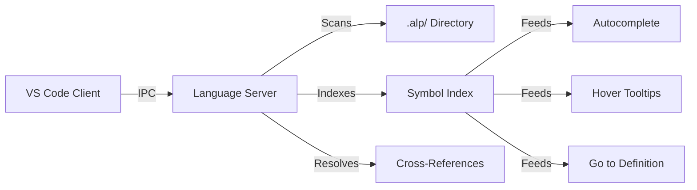

# VS Code Extension (Language Server)

Writing `.alp` files by hand is fast, but it's even faster with proper IDE support.

ALP provides a dedicated **Language Server Protocol (LSP)** implementation for Visual Studio Code via the `alp-vscode` extension.

## Features

- **IntelliSense Autocompletion**: Type `@` to instantly see all available ALP object markers (e.g., `@task`, `@agent`, `@policy`, `@contract`, `@vault`, `@goal`, `@rule`, `@constraint`, `@decision`). Type `->` in any reference field to get an autocomplete dropdown of every ID in your workspace.
- **Interactive Webview DAG Visualizer**: Click the `$(graph) ALP DAG` status bar item or run `ALP: Show Interactive DAG Visualizer` (`alp.showVisualizer`) to open an in-editor Webview visualizer displaying status-colored cards (`[x]`, `[~]`, `[!]`, `[?]`, `[ ]`), object type badges, and workspace metrics side-by-side with your `.alp` files.
- **Go to Definition**: Command-click (or Ctrl-click) on any dependency reference (e.g., `-> dec-database`) to instantly jump your editor to the exact file and line where that object is defined.
- **Hover Metadata**: Hover over any `-> id` reference to pop up a rich tooltip containing the object's description, status, and type without leaving your current file. Hover over block markers and directives for inline documentation.
- **Real-time Diagnostics**: Syntax errors, schema violations, and V9+ status-marker errors (missing reasons for `[!]` and `[?]`) are highlighted with red squigglies directly in your editor as you type.
- **Semantic Highlighting**: Block markers, properties, directives, references, and status markers are color-coded for fast visual scanning.
- **Workspace Symbols**: Browse all objects across your `.alp/` workspace with the VS Code "Go to Symbol in Workspace" command.
- **Rename Refactoring**: Rename any object ID and have all references updated across the entire workspace.
- **Code Actions**: Quick fixes for unresolved references using prefix and substring matching.

## Installation

The extension is bundled as a standard `.vsix` file.

1. Download the latest `alp-vscode-80.0.0.vsix` release from the repository.
2. Open VS Code.
3. Open the Extensions View (`Ctrl+Shift+X` or `Cmd+Shift+X`).
4. Click the `...` menu in the top right of the extensions view.
5. Select **Install from VSIX...**
6. Select the downloaded `.vsix` file.

Alternatively, you can install it via the CLI:

```bash
code --install-extension alp-vscode-80.0.0.vsix
```

## Supported Block Types (V80.0.0)

The extension provides hover documentation and autocomplete for all ALP object types registered in the parser schema index:

| Category | Block Types |
| --- | --- |
| **Core** | `@project`, `@task`, `@feature`, `@workflow`, `@agent`, `@memory`, `@state`, `@artifact`, `@context`, `@repo`, `@swarm`, `@package`, `@plugin`, `@type` |
| **Planning** | `@goal`, `@rule`, `@constraint`, `@decision` |
| **Execution** | `@event`, `@resource`, `@verification`, `@dependency` |
| **Governance** | `@policy`, `@contract`, `@vault`, `@timeline` |
| **V12+** | `@arch_decomposer`, `@edge_model`, `@cost_optimizer`, `@resilience`, `@tenant`, `@governance`, `@domain_trust`, `@identity`, `@p2p`, `@did_identity` |
| **V13+** | `@negotiate`, `@vector_store`, `@sandbox_env`, `@crdt_sync`, `@self_healing`, `@formal_verification`, `@asset_context`, `@cost_budget`, `@tenant_mesh` |
| **V14+** | `@zk_proof`, `@anomaly`, `@prompt_optimizer`, `@code_index`, `@code_transform`, `@event_mesh`, `@swarm_marketplace`, `@consensus_vote`, `@eval_suite` |
| **V38+** | `@macro`, `@collaboration`, `@memory_mesh` |

## Supported Directives

| Directive | Description |
| --- | --- |
| `!alp-version` | Declares the ALP specification version |
| `!import` | Imports another `.alp` file or remote URL |
| `!deprecated` | Marks an object as deprecated with migration note |
| `!assert` | Boolean precondition that must hold (fail-closed since V8) |
| `!if` | Conditionally includes the next object based on ALPEL expression |
| `!integrity` | SHA-256 integrity hash for remote imports |

## How it works

The extension operates as an IPC-based Language Server. Every time you save an `.alp` file, the server scans the `.alp/` directory, updates an internal index of `SymbolEntries`, and provides hyper-fast resolution for autocomplete and hover requests across the entire workspace graph.

## Architecture



## Supported Features

| Feature | Description |
| --- | --- |
| **IntelliSense** | Autocomplete for all block types, properties, and references |
| **Hover** | Rich tooltips with object metadata |
| **Go to Definition** | Jump to object definitions across the workspace |
| **Rename** | Refactor object IDs across all files |
| **Diagnostics** | Real-time error highlighting |
| **DAG Visualizer** | Interactive graph visualization in WebView |

## Supported File Types

| Extension | Language | Support |
| --- | --- | --- |
| `.alp` | ALP Protocol | Full |
| `.alpc` | ALP Config | Partial |

## Keyboard Shortcuts

| Shortcut | Action |
| --- | --- |
| `Ctrl+Space` | Trigger autocomplete |
| `F12` | Go to definition |
| `Ctrl+.` | Quick fix |
| `Shift+F12` | Find all references |
| `F2` | Rename symbol |
| `Ctrl+Shift+M` | Show DAG visualizer |

## Requirements

- VS Code 1.80.0 or higher
- Node.js 18.0.0 or higher (for development)

## Known Limitations

- `.alp` files larger than 10MB may cause performance degradation
- Remote `!import` resolution is deferred to a future release
- Some advanced diagnostics require the full `.alp/` directory structure

## Troubleshooting

**Extension not activating:**

- Ensure you have at least one `.alp` file in your workspace
- Check the VS Code Output panel for "ALP Language Server" logs

**Slow performance:**

- Exclude large directories from the workspace
- Use `.alpignore` to skip unnecessary files

**Missing diagnostics:**

- Verify `!alp-version` is declared at the top of your file
- Ensure all `@` blocks are properly formatted

## Contributing

The VS Code extension is open source. Contributions are welcome at the [ALP repository](https://github.com/Autonomous-Lifecycle-Protocol-ALP/alp-vscode).

## Changelog

### v80.0.0

- Updated block type support for V80.0.0
- Improved DAG visualizer performance
- Fixed hover metadata for nested blocks

### v38.0.0

- Added `@macro`, `@collaboration`, `@memory_mesh` support
- Enhanced semantic highlighting
- Added rename refactoring

### v18.0.0

- Added DID identity block support
- Enhanced hover tooltips with trust registry info
