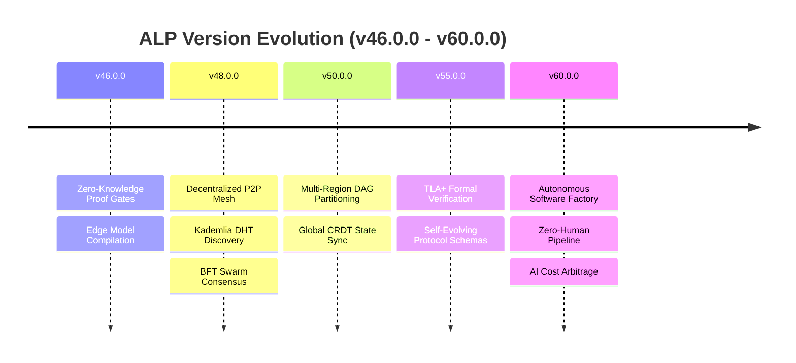

# Autonomous Lifecycle Protocol (ALP) — Strategic Roadmap v46.0.0 – v60.0.0

This document outlines the architectural roadmap for the Autonomous Lifecycle Protocol from version **v46.0.0 through v60.0.0 (2026 – 2028)**.

---

## 🗺️ Roadmap Overview

---

## 🚀 Version Breakdown & Technical Specifications

### 🔹 V46.0.0 — Zero-Knowledge Verification & Edge Models
**Release Target:** Q4 2026

* **Zero-Knowledge Proof Gates (`alp prove` / `alp verify-proof`)**:
  - Generate zk-SNARK cryptographic proofs verifying task execution compliance without revealing proprietary source code or confidential environment secrets.
* **Sub-Millisecond Edge Model Compilation**:
  - Compile topological context bundles directly to WebAssembly (Wasm) and ONNX edge models for zero-network local agent evaluation (< 0.5ms compilation).
* **Enhanced Multi-Language Parity**:
  - Full v46 API synchronization across TypeScript, Python, Go, Rust, and Java SDKs.

---

### 🔹 V48.0.0 — Decentralized Peer-to-Peer Swarm Mesh
**Release Target:** Q1 2027

* **Decentralized Kademlia DHT Agent Discovery**:
  - Eliminate central registry dependencies; agent swarms discover peer skills and capabilities over encrypted libp2p DHT channels.
* **Byzantine Fault Tolerant (BFT) Swarm Consensus**:
  - Implement Tendermint-style BFT consensus for agent voting on policy proposals, state transitions, and contract approvals.
* **Cryptographic Swarm Identity (W3C DIDs)**:
  - Decentralized Identifiers (DIDs) and Verifiable Credentials (VCs) for agent node authorization and tamper-evident audit trails.

---

### 🔹 V50.0.0 — Distributed Multi-Region Execution & Global CRDT Sync
**Release Target:** Q2 2027

* **Multi-Region DAG Partitioning**:
  - Automatically split workspace DAGs across cloud edge nodes (AWS Lambda, Cloudflare Workers, GCP Cloud Run) for parallel multi-agent task execution.
* **Real-Time Operational Transform & CRDT State Sync**:
  - Conflict-Free Replicated Data Types (CRDTs) allowing desktop IDEs (Cursor/VS Code/SHAM) and cloud agent workers to edit `.alp` files simultaneously with zero lock contention.
* **Multi-Tenant Vault Sealing**:
  - Isolated multi-tenant secret vaults backed by hardware security modules (HSM / Cloud KMS).

---

### 🔹 V55.0.0 — Self-Evolving Protocol & Formal Safety Invariants
**Release Target:** Q4 2027

* **TLA+ Formal Verification Engine**:
  - Mathematically verify state machine transitions and prove non-deadlocking agent execution loops prior to code generation.
* **Dynamic Protocol Schema Evolution**:
  - Schema auto-migration engine allowing agents to propose schema upgrades with 100% backward-compatibility guarantees.
* **Autonomous Remediation & Self-Healing Swarms**:
  - Automatic circuit breaker recovery and automated agent reassignment on task verification failure.

---

### 🔹 V60.0.0 — The Autonomous Software Factory (Full Automation Era)
**Release Target:** Q2 2028

* **Zero-Human-In-The-Loop Delivery Pipelines**:
  - Autonomous end-to-end software delivery from raw requirements parsing to canary production deployment and live user telemetry feedback.
* **AI Model Cost Arbitrage Engine**:
  - Dynamic real-time LLM router choosing optimal model providers (Anthropic, OpenAI, Gemini, Local DeepSeek/Llama) based on budget, latency SLAs, and task complexity.
* **Enterprise Autonomous Compliance**:
  - Out-of-the-box SOC2 Type II, ISO 27001, HIPAA, and GDPR verification gate templates.

---

## 📊 Summary Matrix (v46 – v60)

| Version | Focus Area | Key Architectural Innovation |
| :--- | :--- | :--- |
| **v46.0.0** | ZK Verification & Edge Models | zk-SNARK quality gate proofs, Wasm edge bundling |
| **v48.0.0** | Decentralized P2P Swarms | Libp2p DHT discovery, BFT consensus voting |
| **v50.0.0** | Global Multi-Region Execution | Multi-region DAG partitioning, Real-time CRDT sync |
| **v55.0.0** | Formal Invariants & Self-Evolution | TLA+ mathematical safety proofs, Auto-schema migration |
| **v60.0.0** | Autonomous Software Factory | Zero-Human continuous deployment, AI model cost arbitrage |
