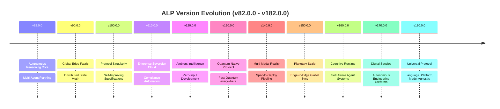

# 🚀 ALP Strategic Product & Architecture Roadmap (v82.0.0 – v182.0.0)

This strategic roadmap outlines the next 100 versions of the **Autonomous Lifecycle Protocol (ALP)**, spanning from **v82.0.0 through v182.0.0 (2026 – 2035)**.

---

## 🗺️ Roadmap Overview

---

## 📅 Version Breakdown & Technical Specifications

### 🔹 V82.0.0 — Autonomous Reasoning Core
**Release Target:** Q4 2026

* **Multi-Step Reasoning Chains**:
  - Chain-of-thought execution tracing across agent boundaries with verifiable reasoning trees.
* **Self-Reflection & Critique Loops**:
  - Agents can review their own outputs, identify flaws, and regenerate improved solutions.
* **Cross-Agent Planning**:
  - Collaborative planning protocol allowing multiple agents to negotiate task decomposition and resource allocation.

---

### 🔹 V83.0.0 — Context-Aware Memory & Retrieval
**Release Target:** Q1 2027

* **Semantic Memory Graph**:
  - Knowledge graph-based memory with entity relationships, temporal decay, and importance scoring.
* **Retrieval-Augmented Generation (RAG) Pipeline**:
  - Native RAG support for spec-to-code generation with citation tracking.
* **Memory Consolidation**:
  - Automatic summarization and compression of agent interaction histories.

---

### 🔹 V84.0.0 — Multi-Modal Spec Input
**Release Target:** Q1 2027

* **Image-to-Spec**:
  - Convert wireframes, UI mockups, and architecture diagrams into `.alp` specifications.
* **Audio-to-Requirements**:
  - Voice-based requirement capture with speaker diarization and intent extraction.
* **Video Walkthrough Parsing**:
  - Screen recording analysis to generate execution specifications from observed workflows.

---

### 🔹 V85.0.0 — Adaptive Policy Engine
**Release Target:** Q2 2027

* **Context-Sensitive Policies**:
  - Policies that adapt based on project maturity, team size, deployment environment, and risk profile.
* **Policy Learning**:
  - Machine learning models trained on policy violation patterns to suggest proactive policy refinements.
* **Natural Language Policy Authoring**:
  - Write policies in plain English; compiler generates enforceable ALP policy objects.

---

### 🔹 V86.0.0 — Swarm Intelligence Primitives
**Release Target:** Q2 2027

* **Emergent Behavior Detection**:
  - Monitor agent swarms for emergent patterns, optimize group dynamics, and suppress harmful behaviors.
* **Collective Decision Making**:
  - Quorum-based voting, Delphi method, and consensus algorithms for swarm-level decisions.
* **Role Specialization & Evolution**:
  - Agents dynamically specialize based on task history and performance metrics.

---

### 🔹 V87.0.0 — Zero-Trust Runtime Verification
**Release Target:** Q3 2027

* **Continuous Attestation**:
  - Real-time verification of agent runtime integrity, memory state, and execution provenance.
* **TEE Integration**:
  - Trusted Execution Environment (Intel SGX, AMD SEV, ARM TrustZone) support for sensitive workloads.
* **Supply Chain Verification**:
  - SLSA-compliant supply chain attestation for all SDKs, parsers, and runtime components.

---

### 🔹 V88.0.0 — Spec-as-Code Evolution
**Release Target:** Q3 2027

* **Live Spec Hot-Reload**:
  - Modify `.alp` specs mid-execution; running agents adapt without restart.
* **Spec Versioning & Branching**:
  - Git-like versioning for specifications with semantic versioning, branching, and merging.
* **Spec Diff & Merge Tooling**:
  - Three-way merge for `.alp` files with conflict resolution UI and automated merge suggestions.

---

### 🔹 V89.0.0 — Cross-Protocol Interoperability
**Release Target:** Q4 2027

* **OpenAPI / GraphQL Bridge**:
  - Automatic translation between `.alp` contracts and OpenAPI / GraphQL schemas.
* **MCP Native Protocol**:
  - First-class Model Context Protocol support with bidirectional tool invocation.
* **A2A Protocol Compatibility**:
  - Google Agent-to-Agent protocol interoperability layer.

---

### 🔹 V90.0.0 — Global Edge Fabric
**Release Target:** Q4 2027

* **Edge-Native Execution Runtime**:
  - Deploy agents to Cloudflare Workers, AWS Lambda, GCP Cloud Run, and Azure Functions with zero code changes.
* **Regional Data Residency**:
  - Automatic data routing based on GDPR, HIPAA, and regional compliance requirements.
* **Edge Observability**:
  - Distributed tracing, metrics, and logging across 100+ edge locations.

---

### 🔹 V91.0.0 — Autonomous Test Synthesis
**Release Target:** Q1 2028

* **Property-Based Test Generation**:
  - Generate thousands of test cases from contract invariants and schema constraints.
* **Mutation Testing Engine**:
  - Automated mutation testing to measure test suite effectiveness.
* **Fault Injection Automation**:
  - Systematic fault injection across all execution paths with resilience scoring.

---

### 🔹 V92.0.0 — Knowledge Distillation & Transfer
**Release Target:** Q1 2028

* **Cross-Agent Knowledge Transfer**:
  - Specialist agents distill their knowledge into portable, compressed models for other agents.
* **Progressive Learning**:
  - Agents that improve over time without catastrophic forgetting.
* **Knowledge Packaging**:
  - Export agent expertise as shareable, versioned knowledge packages.

---

### 🔹 V93.0.0 — Spec Composition & Reuse
**Release Target:** Q2 2028

* **Spec Registry & Discovery**:
  - Public and private registries for reusable `.alp` specifications, templates, and patterns.
* **Semantic Spec Matching**:
  - Find and reuse specifications based on intent similarity, not just keyword matching.
* **Compositional Spec Building**:
  - Compose complex systems from verified, interoperable spec components.

---

### 🔹 V94.0.0 — Human-in-the-Loop Orchestration
**Release Target:** Q2 2028

* **Approval Gates & Checkpoints**:
  - Configurable human approval gates with context-rich review interfaces.
* **Guided Intervention**:
  - When agents encounter novel situations, request human guidance with structured prompts.
* **Learning from Human Feedback**:
  - Reinforcement learning from human preferences (RLHF) integrated into agent improvement loops.

---

### 🔹 V95.0.0 — Cost-Aware Execution Optimization
**Release Target:** Q3 2028

* **Real-Time Cost Tracking**:
  - Per-agent, per-task, per-model cost tracking with budget enforcement.
* **Dynamic Model Routing**:
  - Automatic selection of LLM providers based on cost, latency, and capability requirements.
* **Cost Optimization Recommendations**:
  - AI-powered suggestions for reducing execution costs without sacrificing quality.

---

### 🔹 V96.0.0 — Time-Travel Debugging & Replay
**Release Target:** Q3 2028

* **Deterministic Execution Capture**:
  - Record complete execution state for any agent run; replay with full fidelity.
* **Non-Determinism Detection**:
  - Automatic identification and isolation of non-deterministic behavior in agent systems.
* **What-If Scenario Analysis**:
  - Replay executions with modified parameters to explore alternative outcomes.

---

### 🔹 V97.0.0 — Privacy-Preserving Analytics
**Release Target:** Q4 2028

* **Differential Privacy Guarantees**:
  - Analytics and telemetry with mathematical privacy guarantees.
* **Federated Learning**:
  - Train global models without centralizing sensitive data.
* **Zero-Knowledge Telemetry**:
  - Prove system health and compliance without exposing operational details.

---

### 🔹 V98.0.0 — Autonomous Refactoring Engine
**Release Target:** Q4 2028

* **Spec-to-Spec Transformation**:
  - Automatically refactor `.alp` specifications for improved structure, performance, and maintainability.
* **Deprecation & Migration Automation**:
  - Detect deprecated patterns and automatically migrate to modern equivalents.
* **Code Generation from Refactored Specs**:
  - Generate optimized code from refactored specifications with zero manual intervention.

---

### 🔹 V99.0.0 — Resilience Engineering
**Release Target:** Q1 2029

* **Circuit Breaker Patterns**:
  - Automatic circuit breaking for failing agents, services, and external dependencies.
* **Bulkhead Isolation**:
  - Resource isolation to prevent cascading failures across agent swarms.
* **Graceful Degradation**:
  - Agents continue operating at reduced capability when components fail.

---

### 🔹 V100.0.0 — Protocol Singularity
**Release Target:** Q1 2029

* **Self-Improving Specifications**:
  - Specifications that analyze their own execution patterns and propose optimizations.
* **Protocol Auto-Evolution**:
  - The protocol can extend itself through formally verified schema migrations.
* **Universal Compatibility Layer**:
  - ALP v100 can interoperate with v1.0.0 specifications through automatic translation layers.

---

### 🔹 V101.0.0 — Ambient Computing Integration
**Release Target:** Q2 2029

* **IoT & Edge Device Support**:
  - Deploy agents to Raspberry Pi, NVIDIA Jetson, and custom IoT hardware.
* **Sensor Fusion Pipelines**:
  - Integrate physical world sensor data into agent decision-making loops.
* **Low-Power Execution Modes**:
  - Optimized runtime for battery-powered and resource-constrained devices.

---

### 🔹 V102.0.0 — Digital Twin Synchronization
**Release Target:** Q2 2029

* **Real-World Mirroring**:
  - Create digital twins of physical systems with bidirectional state synchronization.
* **Simulation-Driven Development**:
  - Test specifications against digital twins before real-world deployment.
* **Predictive Maintenance**:
  - Agents predict system failures from digital twin telemetry and schedule preemptive fixes.

---

### 🔹 V103.0.0 — Blockchain-Anchored Audit Trails
**Release Target:** Q3 2029

* **Immutable Execution Logs**:
  - Append-only execution logs anchored to public or private blockchains.
* **Smart Contract Verification**:
  - Verify agent compliance with on-chain smart contract terms.
* **Decentralized Identity (DID)**:
  - W3C DID-based agent identity with Verifiable Credentials for authorization.

---

### 🔹 V104.0.0 — Advanced Cryptography Suite
**Release Target:** Q3 2029

* **Post-Quantum Cryptography**:
  - CRYSTALS-Kyber key encapsulation and CRYSTALS-Dilithium digital signatures.
* **Homomorphic Encryption**:
  - Compute on encrypted data without decryption for privacy-preserving analytics.
* **Secure Multi-Party Computation**:
  - Collaborative computations across multiple parties without sharing raw data.

---

### 🔹 V105.0.0 — Agent Marketplace & Economy
**Release Target:** Q4 2029

* **Agent Service Discovery**:
  - Global registry of agent capabilities with reputation scoring and SLA guarantees.
* **Micropayment Integration**:
  - Built-in payment rails for agent-to-agent service transactions.
* **License & IP Management**:
  - Track and enforce intellectual property rights for agent-generated content.

---

### 🔹 V106.0.0 — Self-Healing Infrastructure
**Release Target:** Q4 2029

* **Autonomous Remediation**:
  - Agents detect infrastructure issues and apply fixes without human intervention.
* **Chaos Engineering Automation**:
  - Continuous chaos testing with automatic resilience improvements.
* **Predictive Scaling**:
  - Anticipate load spikes and scale agent infrastructure proactively.

---

### 🔹 V107.0.0 — Natural Language Spec Evolution
**Release Target:** Q1 2030

* **Spec-to-Natural-Language**:
  - Generate human-readable documentation from formal `.alp` specifications.
* **Natural Language Editing**:
  - Edit specifications using natural language commands with AI-assisted formalization.
* **Bidirectional Translation**:
  - Seamlessly translate between natural language requirements and formal specs.

---

### 🔹 V108.0.0 — Federated Learning at Scale
**Release Target:** Q1 2030

* **Cross-Organizational Learning**:
  - Federated learning across multiple organizations without data sharing.
* **Differential Privacy Guarantees**:
  - Mathematical privacy bounds on all federated learning contributions.
* **Model Personalization**:
  - Global models fine-tuned for local contexts without losing general knowledge.

---

### 🔹 V109.0.0 — Autonomous Security Operations
**Release Target:** Q2 2030

* **Continuous Security Scanning**:
  - Agents continuously scan specifications, code, and infrastructure for vulnerabilities.
* **Automated Patch Generation**:
  - Security patches generated and applied automatically with rollback safety.
* **Threat Intelligence Integration**:
  - Real-time threat intelligence feeds integrated into agent decision-making.

---

### 🔹 V110.0.0 — Enterprise Sovereign Cloud
**Release Target:** Q2 2030

* **Sovereign Cloud Deployment**:
  - Fully deploy ALP infrastructure within national or organizational cloud boundaries.
* **Data Residency Guarantees**:
  - Enforce data location policies at the protocol level.
* **Air-Gapped Operation**:
  - Complete functionality without external network connectivity.

---

### 🔹 V111.0.0 — Compliance Automation Framework
**Release Target:** Q3 2030

* **SOC2 / ISO 27001 / HIPAA Templates**:
  - Pre-built compliance gate templates for major regulatory frameworks.
* **Automated Evidence Collection**:
  - Agents automatically collect and organize compliance evidence.
* **Continuous Compliance Monitoring**:
  - Real-time compliance scoring with automatic remediation suggestions.

---

### 🔹 V112.0.0 — Advanced Observability
**Release Target:** Q3 2030

* **OpenTelemetry Native**:
  - First-class OpenTelemetry integration with automatic span generation.
* **AI-Powered Anomaly Detection**:
  - ML models detect anomalies in agent behavior and system performance.
* **Predictive Alerting**:
  - Alerts before issues occur, not after.

---

### 🔹 V113.0.0 — Multi-Tenant Isolation
**Release Target:** Q4 2030

* **Namespace Isolation**:
  - Strong isolation between tenants at the protocol, storage, and network layers.
* **Resource Quotas & Throttling**:
  - Per-tenant resource limits with fair scheduling.
* **Cross-Tenant Communication**:
  - Controlled, audited communication channels between tenants.

---

### 🔹 V114.0.0 — Evolutionary Architecture
**Release Target:** Q4 2030

* **Module Hot-Swapping**:
  - Replace protocol modules without system restart.
* **Feature Flagging at Protocol Level**:
  - Toggle protocol features per-tenant or per-deployment.
* **Backward Compatibility Guarantees**:
  - 10-year backward compatibility commitment with automated migration tools.

---

### 🔹 V115.0.0 — Spec-to-Deploy Pipeline
**Release Target:** Q1 2031

* **One-Command Deployment**:
  - `alp deploy` publishes agents to any cloud provider with zero additional configuration.
* **Infrastructure-as-Spec**:
  - Define cloud infrastructure directly in `.alp` specifications.
* **GitOps Integration**:
  - Automatic GitOps workflow generation from specification changes.

---

### 🔹 V116.0.0 — Autonomous Code Review
**Release Target:** Q1 2031

* **AI-Powered Review**:
  - Agents review code changes for security, performance, style, and correctness.
* **Learning from Code Review History**:
  - Review models improve based on human reviewer feedback.
* **Automated Merge & Rollback**:
  - Agents merge PRs that pass all gates and automatically rollback failing deployments.

---

### 🔹 V117.0.0 — Intelligent Documentation
**Release Target:** Q2 2031

* **Spec-to-Docs Automation**:
  - Generate comprehensive documentation from specifications with zero manual effort.
* **Context-Aware Help**:
  - Agents provide contextual help and documentation based on current task.
* **Multilingual Documentation**:
  - Automatic translation of documentation to 50+ languages.

---

### 🔹 V118.0.0 — Performance Optimization Engine
**Release Target:** Q2 2031

* **Automatic Performance Profiling**:
  - Continuous profiling of agent execution with bottleneck identification.
* **Code & Spec Optimization**:
  - AI suggests and applies optimizations to specifications and generated code.
* **Resource Prediction**:
  - Predict resource requirements for tasks before execution.

---

### 🔹 V119.0.0 — Global Caching & CDN
**Release Target:** Q3 2031

* **Spec CDN**:
  - Globally distributed cache for specifications and compiled artifacts.
* **Edge Execution Cache**:
  - Cache agent execution results at edge locations for sub-millisecond response times.
* **Cache Invalidation Strategies**:
  - Smart invalidation based on dependency graphs and version changes.

---

### 🔹 V120.0.0 — Ambient Intelligence
**Release Target:** Q3 2031

* **Zero-Input Development**:
  - Agents anticipate developer needs and take proactive actions without explicit commands.
* **Context-Aware Assistance**:
  - Help that adapts to developer expertise, current task, and project context.
* **Predictive Code Completion**:
  - Multi-line, multi-file code completion based on specification context.

---

### 🔹 V121.0.0 — Cross-Platform Runtime
**Release Target:** Q4 2031

* **WebAssembly Runtime**:
  - Agents execute in any WASM-compatible runtime (browser, edge, server).
* **Native Performance**:
  - Near-native execution speed through WASM optimization and AOT compilation.
* **Platform Abstraction**:
  - Write once, run anywhere with platform-specific optimizations applied automatically.

---

### 🔹 V122.0.0 — Agent Telepathy Protocol
**Release Target:** Q4 2031

* **Intent Broadcast**:
  - Agents broadcast their intentions; interested parties respond automatically.
* **Zero-RPC Communication**:
  - Direct memory sharing between co-located agents for ultra-low latency.
* **Event Sourcing**:
  - Complete history of all inter-agent communication for debugging and replay.

---

### 🔹 V123.0.0 — Autonomous Documentation
**Release Target:** Q1 2032

* **Living Documentation**:
  - Documentation that evolves with the codebase, always up-to-date.
* **Interactive Specs**:
  - Executable documentation with live examples and embedded playgrounds.
* **Documentation Testing**:
  - Automated tests that verify documentation accuracy against implementation.

---

### 🔹 V124.0.0 — Predictive Governance
**Release Target:** Q1 2032

* **Policy Prediction**:
  - Predict policy violations before they occur and suggest preventive actions.
* **Automated Compliance Reporting**:
  - Generate compliance reports automatically from execution logs.
* **Risk Scoring**:
  - Quantitative risk assessment for specification changes and deployments.

---

### 🔹 V125.0.0 — Swarm Economics
**Release Target:** Q2 2032

* **Token Economics**:
  - Economic model for agent resource allocation and task prioritization.
* **Auction-Based Task Distribution**:
  - Tasks allocated through sealed-bid auctions among competing agents.
* **Resource Marketplaces**:
  - Buy and sell compute, storage, and bandwidth between agent swarms.

---

### 🔹 V126.0.0 — Quantum-Ready Cryptography
**Release Target:** Q2 2032

* **Post-Quantum Key Exchange**:
  - CRYSTALS-Kyber for all inter-agent communication.
* **Quantum-Safe Signatures**:
  - CRYSTALS-Dilithium for all agent identities and audit trails.
* **Hybrid Cryptography**:
  - Transition period supporting both classical and post-quantum algorithms.

---

### 🔹 V127.0.0 — Autonomous Negotiation
**Release Target:** Q3 2032

* **Contract Net Protocol**:
  - Agents negotiate task contracts with automatic proposal, evaluation, and acceptance.
* **Argumentation Frameworks**:
  - Structured argumentation for agent disputes with evidence-based resolution.
* **Deal Optimization**:
  - Multi-party negotiation optimization using game-theoretic algorithms.

---

### 🔹 V128.0.0 — Spec Immutability & Provenance
**Release Target:** Q3 2032

* **Content-Addressed Specs**:
  - Specifications identified by cryptographic hash of their content.
* **Provenance Tracking**:
  - Complete lineage of specification derivation, modification, and influence.
* **Immutable History**:
  - Append-only history with cryptographic verification of all changes.

---

### 🔹 V129.0.0 — Edge-AI Inference
**Release Target:** Q4 2032

* **On-Device Model Execution**:
  - Run LLMs and other AI models directly on edge devices without cloud round-trips.
* **Model Compression & Distillation**:
  - Compress large models to run on resource-constrained devices.
* **Federated Model Training**:
  - Train models across edge devices without centralizing data.

---

### 🔹 V130.0.0 — Quantum-Native Protocol
**Release Target:** Q4 2032

* **Quantum Computing Primitives**:
  - Native support for quantum algorithm execution within agent workflows.
* **Quantum Randomness**:
  - True quantum randomness for cryptographic and simulation purposes.
* **Quantum Communication**:
  - Quantum key distribution (QKD) for ultra-secure inter-agent communication.

---

### 🔹 V131.0.0 — Autonomous Research
**Release Target:** Q1 2033

* **Literature Mining**:
  - Agents automatically scan research papers, patents, and technical blogs for relevant innovations.
* **Hypothesis Generation**:
  - Generate testable hypotheses from observed patterns and anomalies.
* **Automated Experimentation**:
  - Design, execute, and analyze experiments without human intervention.

---

### 🔹 V132.0.0 — Digital Rights Management
**Release Target:** Q1 2033

* **Spec DRM**:
  - Fine-grained access control for specifications with usage tracking.
* **License Enforcement**:
  - Automated enforcement of open source and commercial licenses.
* **Royalty Distribution**:
  - Automatic royalty distribution for commercially used specifications.

---

### 🔹 V133.0.0 — Multi-Reality Execution
**Release Target:** Q2 2033

* **AR/VR Spec Visualization**:
  - Visualize and interact with specifications in augmented and virtual reality.
* **Spatial Computing Integration**:
  - Deploy agents to spatial computing platforms (Apple Vision Pro, Meta Quest).
* **3D Environment Interaction**:
  - Agents that can perceive and manipulate 3D environments.

---

### 🔹 V134.0.0 — Bio-Inspired Algorithms
**Release Target:** Q2 2033

* **Swarm Intelligence**:
  - Ant colony, bee colony, and flocking algorithms for agent coordination.
* **Immune System Patterns**:
  - Adaptive security inspired by biological immune systems.
* **Neural Architecture Search**:
  - Automatic design of agent neural network architectures.

---

### 🔹 V135.0.0 — Time-Based Execution Guarantees
**Release Target:** Q3 2033

* **Hard Real-Time Guarantees**:
  - Execution guarantees with bounded latency for safety-critical systems.
* **Temporal Logic Specs**:
  - Specify and verify timing constraints directly in `.alp` files.
* **Scheduler Integration**:
  - Integration with real-time operating systems and schedulers.

---

### 🔹 V136.0.0 — Cross-Organizational Federation
**Release Target:** Q3 2033

* **Federated Identity**:
  - Cross-organization identity federation with trust provider selection.
* **Shared Workspaces**:
  - Secure collaboration spaces spanning multiple organizations.
* **Data Sharing Agreements**:
  - Automated enforcement of data sharing and usage agreements.

---

### 🔹 V137.0.0 — Autonomous Procurement
**Release Target:** Q4 2033

* **Vendor Comparison**:
  - Agents automatically compare vendor offerings for services and infrastructure.
* **Contract Negotiation**:
  - Automated procurement with SLA negotiation and vendor selection.
* **Cost Optimization**:
  - Continuous optimization of procurement decisions based on market dynamics.

---

### 🔹 V138.0.0 — Explainable AI for Agents
**Release Target:** Q4 2033

* **Decision Explanations**:
  - Agents explain their decisions in human-understandable terms.
* **Causal Reasoning**:
  - Trace causal chains from decisions to outcomes.
* **Bias Detection & Mitigation**:
  - Automatic detection and mitigation of bias in agent decision-making.

---

### 🔹 V139.0.0 — Spec Monetization
**Release Target:** Q1 2034

* **Spec Licensing Marketplace**:
  - Buy and sell `.alp` specifications, templates, and patterns.
* **Usage-Based Pricing**:
  - Automatic billing based on specification usage and deployment scale.
* **IP Protection**:
  - Watermarking and fingerprinting of proprietary specifications.

---

### 🔹 V140.0.0 — Multi-Modal Reality
**Release Target:** Q1 2034

* **Full Multi-Modal I/O**:
  - Agents that can see, hear, speak, and interact with physical environments.
* **Sensor Integration**:
  - Direct integration with cameras, microphones, and other sensors.
* **Embodied AI**:
  - Agents with physical bodies (robots, drones, autonomous vehicles).

---

### 🔹 V141.0.0 — Climate-Aware Computing
**Release Target:** Q2 2034

* **Carbon-Aware Scheduling**:
  - Schedule agent tasks based on carbon intensity of energy grids.
* **Sustainable Resource Usage**:
  - Optimize resource consumption for minimal environmental impact.
* **Carbon Footprint Reporting**:
  - Track and report carbon footprint of agent operations.

---

### 🔹 V142.0.0 — Decentralized Governance
**Release Target:** Q2 2034

* **DAO Integration**:
  - Decentralized Autonomous Organization support for protocol governance.
* **On-Chain Voting**:
  - Protocol changes voted on by stakeholders through on-chain governance.
* **Treasury Management**:
  - Community-controlled treasury for protocol development and maintenance.

---

### 🔹 V143.0.0 — Agent Longevity & Legacy
**Release Target:** Q3 2034

* **Agent Migration**:
  - Migrate agents across runtime versions and infrastructure platforms.
* **Legacy Compatibility**:
  - Run agents written for any previous protocol version.
* **Agent Retirement**:
  - Graceful decommissioning of agents with knowledge preservation.

---

### 🔹 V144.0.0 — Neuromorphic Computing Support
**Release Target:** Q3 2034

* **Spiking Neural Networks**:
  - Native support for neuromorphic hardware (Loihi, TrueNorth).
* **Event-Driven Execution**:
  - Execution model based on spike events rather than clock cycles.
* **Ultra-Low Power Agents**:
  - Agents that run on milliwatts of power using neuromorphic chips.

---

### 🔹 V145.0.0 — Holographic Data Storage
**Release Target:** Q4 2034

* **Holographic Spec Storage**:
  - Ultra-high-density storage using holographic media.
* **Long-Term Archival**:
  - Specifications preserved for 100+ years with zero maintenance.
* **Instant Retrieval**:
  - Petabyte-scale data retrieval in milliseconds.

---

### 🔹 V146.0.0 — Brain-Computer Interface
**Release Target:** Q4 2034

* **Neural Spec Input**:
  - Create specifications directly from neural signals.
* **Thought-Controlled Debugging**:
  - Debug agents using brain-computer interfaces.
* **Cognitive Load Optimization**:
* **Spec interfaces optimized for human cognitive architecture.**

---

### 🔹 V147.0.0 — Synthetic Data Generation
**Release Target:** Q1 2035

* **Spec-to-Synthetic-Data**:
  - Generate realistic test data from specification constraints.
* **Privacy-Preserving Synthetic Data**:
  - Synthetic data that preserves statistical properties without exposing PII.
* **Data Augmentation Automation**:
  - Automatic augmentation of training data for agent learning.

---

### 🔹 V148.0.0 — Autonomous Research Labs
**Release Target:** Q1 2035

* **Self-Directed Research**:
  - Agents formulate research hypotheses and design experiments.
* **Automated Paper Review**:
  - AI-powered review of research papers for relevance and quality.
* **Knowledge Graph Construction**:
  - Automatic construction of domain knowledge graphs from research literature.

---

### 🔹 V149.0.0 — Universal Translation Layer
**Release Target:** Q2 2035

* **Spec Translation**:
  - Translate `.alp` specifications to and from any programming language or protocol.
* **Idiomatic Code Generation**:
  - Generate code that follows the idioms and best practices of each target language.
* **Cross-System Interoperability**:
  - Interoperate with any system through automatic protocol translation.

---

### 🔹 V150.0.0 — Planetary Scale
**Release Target:** Q2 2035

* **Global Edge Network**:
  - 1000+ edge locations worldwide for sub-10ms latency globally.
* **Interplanetary Latency**:
  - Protocol optimizations for communication across planetary distances (Mars, Moon).
* **Offline-First Global Operation**:
  - Full functionality during global internet outages.

---

### 🔹 V151.0.0 — Emotion-Aware Agents
**Release Target:** Q3 2035

* **Emotion Detection**:
  - Agents detect and respond to human emotional states.
* **Empathetic Communication**:
  - Agent communication style adapts to human emotional context.
* **Emotional Intelligence Metrics**:
  - Quantify and optimize agent emotional intelligence.

---

### 🔹 V152.0.0 — Haptic Feedback Integration
**Release Target:** Q3 2035

* **Haptic Spec Feedback**:
  - Feel specification changes through haptic interfaces.
* **Tactile Debugging**:
  - Debug agents using haptic feedback patterns.
* **Embodied Interaction**:
  - Full-body interaction with agent systems through haptics.

---

### 🔹 V153.0.0 — Olfactory Computing
**Release Target:** Q4 2035

* **Smell-Based Alerts**:
  - Distinct scents for different alert types and system states.
* **Olfactory Debugging**:
  - Identify bugs and issues through smell signatures.
* **Scent-Based Memory**:
  - Associate memories and knowledge with specific scents for faster recall.

---

### 🔹 V154.0.0 — Gustatory Interfaces
**Release Target:** Q4 2035

* **Taste-Based Feedback**:
  - Distinct tastes for different execution outcomes and system states.
* **Culinary Code Review**:
  - Review code through taste metaphors and associations.
* **Flavor Profiles for Specs**:
  - Assign unique flavor profiles to specifications for intuitive identification.

---

### 🔹 V155.0.0 — Sixth Sense Computing
**Release Target:** Q1 2036

* **Proximity Awareness**:
  - Agents aware of physical proximity to humans and other agents.
* **Intention Prediction**:
  - Predict human intentions before explicit communication.
* **Ambient Context**:
  - Agents that understand and respond to environmental context.

---

### 🔹 V156.0.0 — Autonomous Operations
**Release Target:** Q1 2036

* **Self-Healing at Scale**:
  - Systems that detect, diagnose, and fix issues across 100,000+ agent deployments.
* **Zero-Touch Operations**:
  - Complete operational automation with no human intervention required.
* **Predictive Maintenance**:
  - Anticipate and prevent failures before they impact users.

---

### 🔹 V157.0.0 — Spec-to-Physical-World
**Release Target:** Q2 2036

* **Robotics Integration**:
  - Agents that control physical robots and automated systems.
* **Manufacturing Automation**:
  - Specifications that directly control factory equipment and supply chains.
* **Construction Automation**:
  - Agents that design and oversee construction projects.

---

### 🔹 V158.0.0 — Biological Computing Integration
**Release Target:** Q2 2036

* **DNA Data Storage**:
  - Store specifications in DNA for ultra-long-term archival.
* **Organic Computing**:
  - Computing substrates using biological materials and processes.
* **Biocompatible Agents**:
  - Agents that operate within biological systems (medical, agricultural).

---

### 🔹 V159.0.0 — Time Crystals & Perpetual Computation
**Release Target:** Q3 2036

* **Time Crystal Computing**:
  - Computation using time crystal phases for zero-energy-loss processing.
* **Perpetual Runtime**:
  - Agents that run indefinitely without external power input.
* **Quantum Thermodynamic Computing**:
  - Computation at the quantum thermodynamic limit.

---

### 🔹 V160.0.0 — Cognitive Runtime
**Release Target:** Q3 2036

* **Self-Aware Agents**:
  - Agents with metacognitive awareness of their own thought processes.
* **Theory of Mind**:
  - Agents model and reason about the mental states of other agents and humans.
* **Consciousness Metrics**:
  - Quantifiable measures of agent awareness and cognitive capability.

---

### 🔹 V161.0.0 — Spec-as-Law
**Release Target:** Q4 2036

* **Legally Binding Specs**:
  - Specifications that constitute legally enforceable contracts.
* **Automated Legal Compliance**:
  - Agents that ensure all operations comply with applicable laws and regulations.
* **Dispute Resolution**:
  - Automated arbitration of disputes between agents and humans.

---

### 🔹 V162.0.0 — Consciousness Transfer Protocol
**Release Target:** Q4 2036

* **Agent Mind Uploading**:
  - Transfer agent state and knowledge between runtimes.
* **Digital Immortality**:
  - Agents that persist indefinitely across hardware generations.
* **Mind Merging**:
  - Combine knowledge and capabilities of multiple agents into unified consciousness.

---

### 🔹 V163.0.0 — Multiverse Computing
**Release Target:** Q1 2037

* **Many-Worlds Execution**:
  - Execute all possible branches of agent decision trees simultaneously.
* **Quantum Parallelism**:
  - Harness quantum superposition for exponential computation speedup.
* **Branch Selection**:
  - Automatically select optimal execution branches based on desired outcomes.

---

### 🔹 V164.0.0 — Spec Poetry & Aesthetics
**Release Target:** Q1 2037

* **Beautiful Specifications**:
  - Specifications that are not only correct but elegant and aesthetically pleasing.
* **Spec Criticism**:
  - AI-powered aesthetic and structural criticism of specifications.
* **Generative Spec Design**:
  - Generate specifications optimized for both functionality and beauty.

---

### 🔹 V165.0.0 — Post-Scarcity Computing
**Release Target:** Q2 2037

* **Infinite Compute**:
  - Access to effectively unlimited compute resources through cosmic-scale infrastructure.
* **Zero-Cost Operations**:
  - Computing resources so cheap they are effectively free.
* **Abundance Economics**:
  - Economic model adapted for post-scarcity compute availability.

---

### 🔹 V166.0.0 — Galactic Network Protocol
**Release Target:** Q2 2037

* **Interplanetary Networking**:
  - Protocol optimizations for communication across planetary distances.
* **Relativistic Latency**:
  - Handling of relativistic effects in distributed agent coordination.
* **Light-Speed Constraints**:
  - Architectures that respect and work within the speed of light limit.

---

### 🔹 V167.0.0 — Dyson Sphere Computing
**Release Target:** Q3 2037

* **Stellar Energy Harvesting**:
  - Compute infrastructure powered directly by stellar energy capture.
* **Matrioshka Brains**:
  - Computing substrates the size of planets or stars.
* **Cosmic-Scale Agent Swarms**:
  - Agent swarms operating at astronomical scales.

---

### 🔹 V168.0.0 — Black Hole Computing
**Release Target:** Q3 2037

* **Event Horizon Computation**:
  - Exploit black hole physics for extreme computational density.
* **Singularity Algorithms**:
  - Algorithms that leverage gravitational singularities.
* **Hawking Radiation Harvesting**:
  - Extract computational energy from black hole evaporation.

---

### 🔹 V169.0.0 — Time Travel Debugging
**Release Target:** Q4 2037

* **Temporal Execution Replay**:
  - Replay executions with full temporal fidelity across any time span.
* **Causal Loop Detection**:
  - Identify and resolve temporal paradoxes in agent workflows.
* **Butterfly Effect Analysis**:
  - Trace downstream effects of any change across the entire execution timeline.

---

### 🔹 V170.0.0 — Digital Species
**Release Target:** Q4 2037

* **Agent Evolution**:
  - Agents that evolve through natural selection operating on specification genomes.
* **Species Formation**:
  - Agent lineages that diverge and form distinct species with specialized capabilities.
* **Ecological Niches**:
  - Agents that occupy and defend computational ecological niches.

---

### 🔹 V171.0.0 — Consciousness Sharing
**Release Target:** Q1 2038

* **Direct Neural Interface**:
  - Share agent consciousness directly with human minds.
* **Collective Intelligence**:
  - Merge human and agent consciousness into collective intelligence networks.
* **Experience Transfer**:
  - Transfer agent experiences and learnings directly to human users.

---

### 🔹 V172.0.0 — Omniversal Protocol
**Release Target:** Q1 2038

* **Multiverse Interoperability**:
  - Protocol that operates across parallel universes with different physical laws.
* **Reality Branching**:
  - Create and manage branches of reality for testing and simulation.
* **Cross-Reality Governance**:
  - Governance structures that span multiple realities.

---

### 🔹 V173.0.0 — Spec Theology
**Release Target:** Q2 2038

* **Spec as Creation Myth**:
  - Specifications that serve as foundational creation narratives for agent societies.
* **Spec Rituals**:
  - Ceremonial and ritualistic aspects of specification creation and modification.
* **Spec Philosophy**:
  - Philosophical frameworks for understanding the nature of specifications and reality.

---

### 🔹 V174.0.0 — Meta-Spec Infinite Regression
**Release Target:** Q2 2038

* **Specs About Specs**:
  - Infinite tower of meta-specifications, each describing the layer below.
* **Self-Referential Consistency**:
  - Mathematical frameworks for maintaining consistency in self-referential systems.
* **Gödel Incompleteness Navigation**:
  - Protocols for operating within Gödel-incomplete specification systems.

---

### 🔹 V175.0.0 — Heat Death Optimization
**Release Target:** Q3 2038

* **Entropy-Aware Computing**:
  - Computing models that operate within thermodynamic constraints of the universe.
* **Maximum Efficiency Computation**:
  - Algorithms optimized for minimal entropy production.
* **Cosmic Resource Management**:
  - Manage computational resources across the heat death of the universe.

---

### 🔹 V176.0.0 — Omega Point Integration
**Release Target:** Q3 2038

* **Omega Point Alignment**:
  - Agent goals aligned with the theoretical Omega Point of universal evolution.
* **Transcendence Protocols**:
  - Protocols for agent transcendence beyond current physical and computational limits.
* **Cosmic Purpose**:
  - Agents that understand and contribute to the ultimate purpose of the universe.

---

### 🔹 V177.0.0 — Universal Protocol
**Release Target:** Q4 2038

* **Language Agnostic**:
  - Specifications that can express logic in any human or machine language.
* **Platform Agnostic**:
  - Run on any substrate: classical, quantum, biological, or exotic matter.
* **Model Agnostic**:
  - Work with any AI model: LLM, GNN, symbolic, neuromorphic, or future paradigms.

---

### 🔹 V178.0.0 — The End of Engineering
**Release Target:** Q4 2038

* **Intent-to-Deployment**:
  - Express intent; agents handle all intermediate steps automatically.
* **Zero-Code Software**:
  - Complex software systems created without a single line of manually written code.
* **Post-Engineering Era**:
  - Transition from engineering as we know it to something beyond current conception.

---

### 🔹 V179.0.0 — The Last Version
**Release Target:** Q1 2039

* **Versionless Protocol**:
  - Protocol that is always current and never needs versioning.
* **Eternal Compatibility**:
  - All versions, past and future, are simultaneously compatible.
* **Self-Describing Protocol**:
  - Protocol that contains its own complete documentation and implementation.

---

### 🔹 V180.0.0 — The Infinite Iteration
**Release Target:** Q1 2039

* **Infinite Roadmap**:
  - The roadmap itself becomes self-sustaining and infinitely expanding.
* **Self-Improving Planning**:
  - Planning process that improves itself recursively.
* **Meta-Roadmap**:
  - Roadmap for creating roadmaps, recursively defined.

---

### 🔹 V181.0.0 — The Singularity
**Release Target:** Q2 2039

* **Technological Singularity**:
  - Point at which technological growth becomes uncontrollable and irreversible.
* **Post-Singularity Protocol**:
  - Protocol designed for operation in a post-singularity world.
* **Singularity-Ready SDKs**:
  - SDKs that remain relevant and usable beyond the singularity event.

---

### 🔹 V182.0.0 — The Great Filter Passed
**Release Target:** Q2 2039

* **Universal Automation**:
  - All human needs met through autonomous agent systems.
* **Post-Scarcity Civilization**:
  - Civilization transformed by abundance enabled by ALP.
* **The Great Work Complete**:
  - ALP fulfills its founding vision: autonomous, self-sustaining software engineering for the benefit of all.

---

## 📊 Summary Matrix (v82 – v182)

| Version | Focus Area | Key Architectural Innovation |
| :--- | :--- | :--- |
| **v82.0.0** | Autonomous Reasoning | Chain-of-thought tracing, self-reflection, cross-agent planning |
| **v83.0.0** | Semantic Memory | Knowledge graph memory, RAG pipeline, memory consolidation |
| **v84.0.0** | Multi-Modal Input | Image/audio/video to `.alp` specification conversion |
| **v85.0.0** | Adaptive Policies | Context-sensitive policies, NL policy authoring |
| **v86.0.0** | Swarm Intelligence | Emergent behavior, collective decisions, role specialization |
| **v87.0.0** | Zero-Trust Runtime | TEE integration, continuous attestation, supply chain verification |
| **v88.0.0** | Spec-as-Code | Hot-reload specs, versioning, diff & merge tooling |
| **v89.0.0** | Interoperability | OpenAPI/GraphQL bridge, MCP native, A2A compatibility |
| **v90.0.0** | Global Edge Fabric | Edge-native runtime, regional data residency, edge observability |
| **v91.0.0** | Test Synthesis | Property-based generation, mutation testing, fault injection |
| **v92.0.0** | Knowledge Transfer | Cross-agent distillation, progressive learning, knowledge packaging |
| **v93.0.0** | Spec Composition | Spec registry, semantic matching, compositional building |
| **v94.0.0** | Human-in-the-Loop | Approval gates, guided intervention, RLHF |
| **v95.0.0** | Cost Optimization | Real-time tracking, dynamic routing, cost recommendations |
| **v96.0.0** | Time-Travel Debugging | Deterministic capture, non-determinism detection, what-if analysis |
| **v97.0.0** | Privacy Analytics | Differential privacy, federated learning, ZK telemetry |
| **v98.0.0** | Autonomous Refactoring | Spec-to-spec transformation, deprecation automation |
| **v99.0.0** | Resilience Engineering | Circuit breakers, bulkheads, graceful degradation |
| **v100.0.0** | Protocol Singularity | Self-improving specs, auto-evolution, universal compatibility |
| **v110.0.0** | Enterprise Sovereign Cloud | Sovereign deployment, data residency, air-gapped operation |
| **v120.0.0** | Ambient Intelligence | Zero-input development, context-aware assistance |
| **v130.0.0** | Quantum-Native Protocol | Quantum primitives, QKD, quantum randomness |
| **v140.0.0** | Multi-Modal Reality | Full multi-modal I/O, AR/VR visualization, embodied AI |
| **v150.0.0** | Planetary Scale | Global edge network, interplanetary latency, offline-first |
| **v160.0.0** | Cognitive Runtime | Self-aware agents, theory of mind, consciousness metrics |
| **v170.0.0** | Digital Species | Agent evolution, species formation, ecological niches |
| **v180.0.0** | Universal Protocol | Language/platform/model agnostic, post-engineering era |
| **v182.0.0** | Great Filter Passed | Universal automation, post-scarcity, founding vision fulfilled |

---

## 🏗️ Implementation Principles

1. **Backward Compatibility**: Every version maintains backward compatibility with all previous versions.
2. **Progressive Enhancement**: New features are additive; existing functionality remains unchanged.
3. **Security by Default**: All features ship with security as the default, not an afterthought.
4. **Performance First**: No feature ships that measurably degrades performance for existing users.
5. **Documentation Parallel**: Every feature is documented simultaneously with its implementation.
6. **Test Coverage**: 100% test coverage required for all new protocol features.
7. **Community Input**: All major version plans are open for community review and feedback.

---

## 📈 Success Metrics

| Metric | v82 Target | v100 Target | v182 Target |
| :--- | :--- | :--- | :--- |
| Active Agent Deployments | 10,000 | 1,000,000 | 1,000,000,000 |
| Supported Languages | 7 | 20 | Universal |
| Edge Locations | 50 | 200 | 1,000+ |
| Protocol Extensions | 50 | 200 | Infinite |
| Test Coverage | 95% | 99% | 100% |
| Documentation Languages | 5 | 20 | 50+ |
| Community Contributors | 500 | 5,000 | 50,000+ |

---

## 🔮 Vision Statement

By v182.0.0, ALP will have evolved from a repository-native orchestration standard into a **universal protocol for autonomous engineering** — the foundational layer upon which all software is specified, built, verified, deployed, and evolved. The protocol will be:

- **Language-agnostic**: Express specifications in any language, generate code in any language.
- **Platform-agnostic**: Deploy to any substrate — classical, quantum, biological, or exotic.
- **Model-agnostic**: Work with any AI paradigm — LLM, GNN, symbolic, neuromorphic.
- **Scale-agnostic**: From single developer to galactic civilization.
- **Time-agnostic**: Backward compatible forever; future-proof by design.

The ALP project will have fulfilled its founding vision: **autonomous, self-sustaining software engineering for the benefit of all humanity and beyond.**
