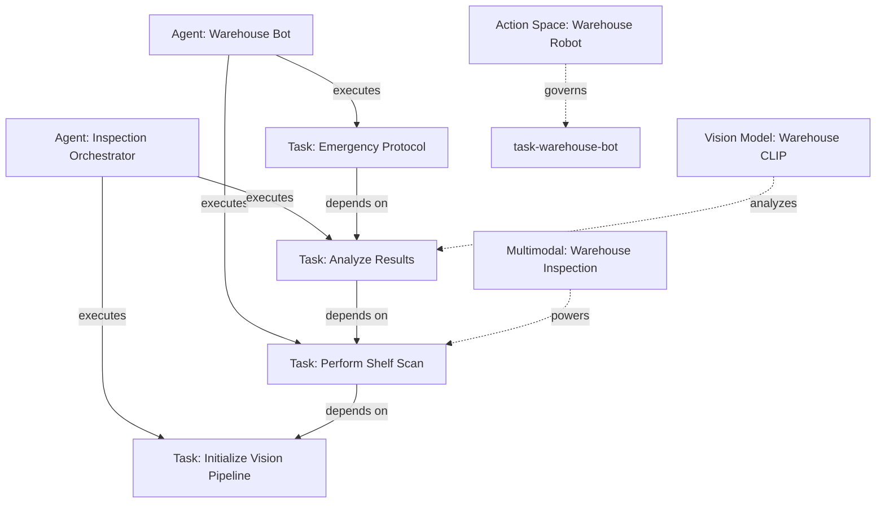

# Multi-Modal VLA Example

A comprehensive reference implementation of an autonomous warehouse robot vision inspection system using **ALP v82.0.0** and the **Multi-Modal & VLA Protocol Engine**.

## Architecture Overview

This example demonstrates how multimodal specifications, vision models, and action spaces integrate with the Synapse Knowledge Graph:



## Directory Structure

```
examples/multimodal-vla/
├── .alp/
│   ├── project.alp         # Project manifest
│   ├── vision_model.alp    # Vision model definitions (CLIP, Thermal)
│   ├── action_space.alp    # Robot action definitions & safety guards
│   ├── multimodal.alp      # Multimodal spec with vision + LiDAR + sensors
│   └── tasks.alp           # VLA lifecycle tasks & dependency DAG
├── src/
│   └── index.ts            # Programmatic Multi-Modal VLA orchestrator
└── README.md
```

## CLI Usage

You can validate and inspect this workspace using the official ALP CLI:

```bash
# 1. Validate all multimodal specifications
npx alp multimodal validate --file .alp/multimodal.alp

# 2. Validate action space safety guards
npx alp action-space check

# 3. Estimate token costs for vision models
npx alp token-cost --modalities vision,sensor,spatial

# 4. Export Synapse knowledge graph with multimodal annotations
npx alp synapse export --out .synapse --canvas
```

## Programmatic SDK Usage

```typescript
import { MultiModalEngine, SynapseEngine } from '@autonomous-lifecycle-protocol-alp/sdk';
import { AlpParser } from '@autonomous-lifecycle-protocol-alp/parser';

const parser = new AlpParser();
const objects = parser.parse(alpFileContent);

const multimodalEngine = new MultiModalEngine();

// Validate multimodal spec
const mmResult = multimodalEngine.validateMultimodal(spec);
console.log(`Valid: ${mmResult.valid}, Tokens: ${mmResult.totalTokensEstimate}`);

// Validate vision model
const vmResult = multimodalEngine.validateVisionModel(visionModelSpec);

// Validate action space
const asResult = multimodalEngine.validateActionSpace(actionSpaceSpec);

// Estimate token costs
const tokens = multimodalEngine.estimateTokenCost(
  ['vision', 'sensor', 'spatial'],
  assets,
  visionModel
);

// Verify safety guards
const guardResult = multimodalEngine.verifySafetyGuards(actionSpace, [
  'enforce-human-in-the-loop',
  'strict-boundary',
]);

// Generate Synapse knowledge graph
const synapseEngine = new SynapseEngine();
const topology = synapseEngine.buildTopology(objects);
const vaultFiles = synapseEngine.generateVault(objects);
const canvas = synapseEngine.generateCanvas(topology);
```

## Specifications

### Vision Models
- **model-warehouse-clip**: CLIP backbone for general object detection (768-dim, 1080p, 4096 tokens)
- **model-thermal-detector**: Custom backbone for thermal anomaly detection (512-dim, VGA, 2048 tokens)

### Action Space
- **as-warehouse-robot**: Robot actions including navigation, shelf scanning, item picking, and emergency stop
  - Safety guards: `enforce-human-in-the-loop`, `strict-boundary`
  - Critical actions require explicit confirmation

### Multimodal
- **mm-warehouse-inspection**: Fused vision + LiDAR + sensor stream
  - Front camera (1080p MP4)
  - LiDAR point cloud (PCD)
  - Temperature sensor (binary UDP stream, 1kHz)
