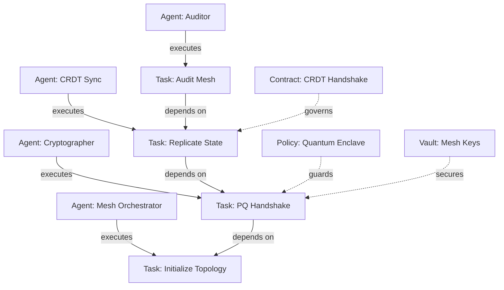

# Synapse Distributed Mesh Example

A comprehensive reference implementation of a multi-agent autonomous software engineering cluster using **ALP v80.0.0** and the **Synapse Knowledge Graph & Canvas Vault Engine**.

## Architecture Overview

This example demonstrates how distinct ALP objects interact in an interconnected topology:



## Directory Structure

```
examples/synapse-mesh/
├── .alp/
│   ├── project.alp      # Project manifest
│   ├── agents.alp       # Agent definitions & roles
│   ├── contracts.alp    # Multi-agent behavioral contracts
│   ├── policies.alp     # Security policies & encrypted vaults
│   └── tasks.alp        # Lifecycle tasks & dependency DAG
├── src/
│   └── index.ts         # Programmatic Synapse engine orchestrator
└── README.md
```

## CLI Usage

You can export and inspect this workspace using the official ALP CLI:

```bash
# 1. Export as Obsidian/Canvas Markdown Vault with [[wikilinks]]
npx alp synapse export --out .synapse --canvas

# 2. Inspect graph topology statistics
npx alp synapse stats

# 3. Generate Mermaid or Graphviz representations
npx alp synapse graph --format mermaid
npx alp synapse graph --format dot --out graph.dot
```

## Programmatic SDK Usage

```typescript
import { SynapseEngine } from '@autonomous-lifecycle-protocol-alp/sdk';
import { AlpParser } from '@autonomous-lifecycle-protocol-alp/parser';

const parser = new AlpParser();
const objects = parser.parse(alpFileContent);

const engine = new SynapseEngine();
const topology = engine.buildTopology(objects);

// Generate Markdown vault notes + MOC.md
const vaultFiles = engine.generateVault(objects);

// Generate interactive .canvas diagram
const canvas = engine.generateCanvas(topology);
```
