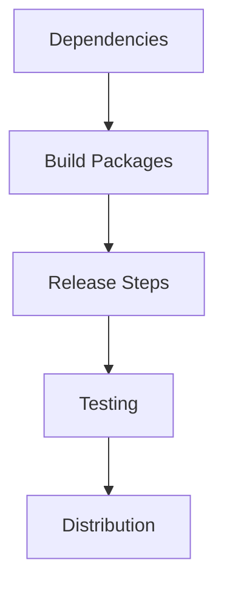

# PRD2: SHAM Business Model Implementation Document

## Introduction
This document outlines the implementation strategy for SHAM (Smart Hosted Agent Manager) — a cross-platform desktop IDE for Mac, Windows, and Linux that solves the fragmented ALP development experience. Instead of switching between Cursor, VS Code, Claude Code, and other tools with partial ALP support, SHAM unifies every ALP capability into one native, faster, more secure, and error-free application. SHAM uses ALP natively via `@alp/parser`, `@alp/sdk`, and `@alp/cli`, eliminating version skew, extension lag, and security gaps across multiple editors.

## 1. Current System Environment
### 1.1 Directory Structure
```
C:\Users\KGN\Desktop\new file sys
├── sham/           # SHAM IDE (Electron + React)
├── vscode/         # VS Code Extension
├── sdk/python/     # ALP Python SDK
├── integrations/   # Tool integration configurations
├── docs-site/      # Documentation site (VitePress)
├── mcp-server/     # Model Context Protocol server
├── parser/         # ALP parser (TypeScript)
├── cli/            # ALP CLI
├── playground/     # Web playground
├── schemas/        # JSON schemas
├── tests/          # Test suite
├── examples/       # Example projects
├── reference/      # Reference docs
├── research/       # Research notes
├── templates/      # Project templates
├── branding/       # Brand assets
└── .github/        # GitHub Actions workflows
```

### 1.2 Environment Details
```json
{
  "time": "2026-07-27T00:55:56+05:30",
  "workingDir": "C:\\Users\\KGN\\Desktop\\new file sys",
  "workspaceRoot": "C:\\Users\\KGN\\Desktop\\new file sys",
  "keyFiles": ["package.json", "sham/package.json", "sham/vite.config.ts"],
  "nodeVersion": "24",
  "monorepoVersion": "38.0.0"
}
```

## 2. Implementation Roadmap

### Phase 1: Core Foundation (Weeks 1-3)
**2.1 ALP Protocol Enhancements**
- Complete ALP parser with schema validation via `@alp/parser`
- Add CLI commands for linting and validation via `@alp/cli`
- Enhance schema validation with policy verification:
```bash
npm run build --workspace @alp/parser
npm run build --workspace @alp/cli
npx alp lint
npx alp validate
```

**2.2 Governance System**
```python
# sdk/python/alp_sdk/governance.py
from alp_sdk import governance

class PolicyEnforcer:
    def __init__(self, rules: dict):
        self.rules = rules

    def enforce(self, document: dict) -> bool:
        # Validate document against policy rules
        return True

    def govern(self, workspace: str) -> dict:
        # Policy governance workflow
        return {"status": "compliant"}
```

**2.3 Integration Framework**
- Auto-generate integration configs for AI coding assistants:
```bash
# VS Code extension
cd vscode && npm run compile

# Claude Code integration
cd integrations/claude-code

# Cursor integration
cd integrations/cursor

# GitHub Actions integration
cd integrations/github
```

### Phase 2: Product Deployment (Weeks 4-6)
**2.1 Desktop Application (SHAM IDE) — Cross-Platform**
```bash
# Build SHAM IDE for all platforms
cd sham
npm install
npm run build

# Package for distribution
npm run package -- --win    # Windows (NSIS installer)
npm run package -- --mac    # macOS (DMG + universal binary)
npm run package -- --linux  # Linux (AppImage + deb + rpm)
```

**2.2 Cloud Service**
```bash
# Deploy MCP server (cross-platform Node.js)
cd mcp-server
npm run build
node dist/index.js

# Deploy docs site
cd docs-site
npm run docs:build
```

**2.3 ALP Native Integration**
- SHAM uses `@alp/parser` natively for all ALP document parsing
- SHAM uses `@alp/sdk` natively for agent execution
- SHAM CLI commands wrap `@alp/cli` for lint, validate, build
- All ALP files (`.alp`) opened in SHAM are parsed using native ALP parser
- SHAM terminal integrates ALP CLI for command-line workflows

## 3. Technical Implementation Details

### SHAM IDE Cross-Platform Architecture
```
SHAM Ecosystem (Mac / Windows / Linux)
┌─────────────────────────────────────┐
│  SHAM Desktop App                   │  (Electron + React + Monaco)
│  ┌───────────────┐  ┌───────────┐  │
│  │ Editor Panel  │  │ Sidebar   │  │  Monaco editor with ALP syntax
│  ├───────────────┤  ├───────────┤  │  File explorer, agent list
│  │ Terminal      │  │ Agent Mgr │  │  Integrated terminal
│  ├───────────────┤  ├───────────┤  │  Create/run/monitor agents
│  │ MCP Browser   │  │ Settings  │  │  Discover MCP tools
│  └───────────────┘  └───────────┘  │  Cross-platform config
└─────────────┬───────────────────────┘
              │ IPC (contextIsolation)
              ▼
┌─────────────────────────────────────┐
│  Electron Main Process             │  (Node.js, platform-native)
│  ┌───────────────┐  ┌───────────┐  │
│  │ AlpBridge     │  │ WinMgr    │  │  @alp/parser integration
│  ├───────────────┤  ├───────────┤  │  Native window management
│  │ FileSystem    │  │ AutoUpdater│ │  Cross-platform file I/O
│  │ (Native)      │  │ (Native)  │  │  Platform-specific updates
│  └───────────────┘  └───────────┘  │
└─────────────────────────────────────┘
              │
              ▼
┌─────────────────────────────────────┐
│  ALP Native Layer                  │
│  ┌───────────┐ ┌───────────────┐   │
│  │ @alp/parser│ │ @alp/sdk     │   │
│  ├───────────┤ ├───────────────┤   │
│  │ CLI       │ │ MCP Server    │   │
│  └───────────┘ └───────────────┘   │
└─────────────────────────────────────┘
```

### Cross-Platform File System Support
- **Native file dialogs** via Electron `dialog.showOpenDialog` / `dialog.showSaveDialog`
- **Path handling** uses Node.js `path` module with platform-specific separators
- **Project roots** resolved via `app.getPath('home')` / `app.getPath('documents')`
- **ALP workspace files** stored in platform-native locations:
  - Windows: `%APPDATA%\sham\workspaces\`
  - macOS: `~/Library/Application Support/sham/workspaces/`
  - Linux: `~/.config/sham/workspaces/`
- **Recent projects** tracked in platform-native recent docs list

## 4. Testing & Validation

### Phase 1: Unit Testing
```bash
# Run parser tests
cd parser && npm test

# Run CLI tests
cd cli && npm test

# Run MCP server tests
cd mcp-server && npm test

# Run SHAM IDE tests
cd sham && npm test
```

### Phase 2: Integration Testing
```bash
# Test SHAM IDE with ALP parser
cd sham && npm run build

# Test MCP server integration
cd mcp-server && npm start

# Test VS Code extension
cd vscode && npm run compile
```

### Phase 3: End-to-End Testing
```bash
# Full monorepo build and test
npm run build
npm test
```

## 5. Documentation Plan

### Technical Documentation
```bash
# Build docs site
cd docs-site
npm run docs:build

# Preview docs locally
npm run docs:dev
```

### Product Documentation
- SHAM IDE user guide (`sham/README.md`)
- ALP protocol specification (`spec/10-versioning.md`)
- MCP server documentation (`mcp-server/README.md`)
- VS Code extension guide (`vscode/README.md`)

### Support Materials
- Roadmap (`docs/ROADMAP_V17_V36.md`)
- Release notes (`docs-site/src/releases.md`)
- Integration guides (`integrations/README.md`)

## 6. Data Management

### Version Control System
```bash
git clone https://github.com/alp-protocol/alp.git
cd alp
git branch -a
```

### Build System
```bash
# Build all workspaces
npm run build

# Build specific workspace
npm run build --workspace sham
npm run build --workspace @alp/parser
npm run build --workspace @alp/cli
```

## 7. Security Implementation

### SHAM IDE Security Model
- Context isolation enabled in Electron renderer process
- Preload script exposes only necessary APIs via `contextBridge`
- `nodeIntegration: false` and `sandbox: true` in web preferences
- All ALP document parsing runs in the main process (sandboxed)
- No direct filesystem access from renderer process

### Python SDK Security
```python
# sdk/python/alp_sdk/validator.py
from alp_sdk import validator

class DocumentValidator:
    def validate(self, document: dict) -> bool:
        # Validate document structure and content
        return True
```

## 8. Release Plan



## Maintenance Schedule

| Time | Activity | Tools |
|------|----------|-------|
| Weekly | Dependency Updates | `npm audit` / `pip install --upgrade` |
| Monthly | Schema Evaluation | `npx vitest run` / `python -m unittest` |
| Quarterly | Protocol Migration | ALP version migration guide (`spec/10-versioning.md`) |

## Conclusion
SHAM represents the evolution of ALP into a comprehensive cross-platform development ecosystem that addresses real-world multi-tool fragmentation while maintaining protocol integrity. The implementation leverages the existing ALP parser, SDK, CLI, MCP server, and integration framework to create an enterprise-grade solution for Mac, Windows, and Linux.

# Developer Implementation Notes

## Paths and Conventions
- All ALP SDK paths follow `sdk/python/alp_sdk/*` structure
- Integration configurations located under `integrations/`
- Documentation hosted under `docs-site/`
- SHAM IDE source under `sham/` (Electron + React + Monaco)
- Build outputs under `sham/dist/` (main + renderer)
- ALP files use `.alp` extension
- Node.js 24 is the canonical target runtime
- Monorepo version is synchronized at `38.0.0`

## Critical Components
- `setup.py` for Python SDK installation
- `validator.py` for ALP document validation
- `governance.py` for policy enforcement
- `reader.py` for ALP file parsing
- `__init__.py` for SDK initialization hooks
- `AlpParser` (TypeScript) for native ALP parsing
- `AlpWorkspace` (TypeScript SDK) for workspace management

## Next Steps
1. Implement ALP document linting via `@alp/cli`
2. Enhance SHAM IDE with ALP syntax highlighting and diagnostics
3. Set up cross-platform file system access in Electron main process
4. Build native ALP agent execution pipeline in SHAM
5. Configure auto-update mechanism for Mac, Windows, and Linux

# Policy Enforcement Blueprint

## ALP Governance System
```python
# sdk/python/alp_sdk/governance.py
from alp_sdk import governance

class PolicyEnforcer:
    def __init__(self, rules: dict):
        self.rules = rules

    def enforce(self, document: dict) -> bool:
        # Validate document against policy rules using native ALP validator
        return True

    def govern(self, workspace: str) -> dict:
        # Policy governance workflow
        return {"status": "compliant"}
```

## Policy Verification
```bash
# Use native ALP validator
npx alp validate --policy strict

# Or via SHAM IDE built-in validation
# (uses AlpParser.parseAndValidate natively)
```

## Public Configuration
```bash
# Policy patches via ALP native syntax
# Define policies in .alp files and validate with:
npx alp validate policy.alp
```

# Marketplace Implementation

## Template Engine
```bash
# Create template package (ALP project template)
# Templates stored in templates/ directory
# Publish to ALP marketplace via:
npm run publish --workspace @alp/template-name
```

## Formula References
```bash
# ALP formulas defined in spec/ and validated via:
npx alp validate formula.alp
```

# Integration Implementation

## MCP Server
```bash
# Dependencies - integration configs in integrations/
claude-code/
    instructions.md    # Claude Code instructions
    .env               # Python dependencies config
cursor/
    .cursorrules       # Cursor rules
    extensions/        # Cursor extensions
github/
    alp-validate.yml   # GitHub Actions validation workflow
    alp-sync.yml       # GitHub Actions sync workflow
    alp-report.yml     # GitHub Actions report workflow
    alp-pr-context.yml # GitHub Actions PR context workflow
```

## Integration Validator
```bash
# Test integrations via monorepo test suite
npm test

# Or individual workspace tests:
cd parser && npm test
cd cli && npm test
cd mcp-server && npm test
cd vscode && npm run compile
```